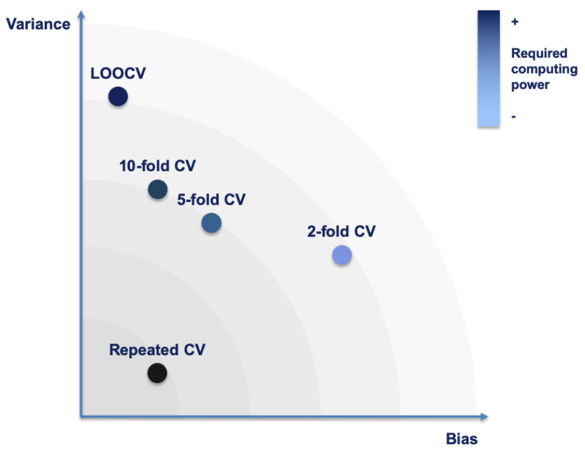
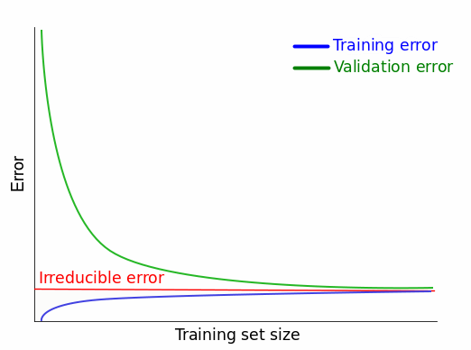

<script src="index_files/kePrint/kePrint.js"></script>
<link href="index_files/lightable/lightable.css" rel="stylesheet" />
<script src="index_files/kePrint/kePrint.js"></script>
<link href="index_files/lightable/lightable.css" rel="stylesheet" />


# What is model validation?

A key term in k-fold cross validation is the last one. As such, I would like to preface my implementation of the algorithm, with a discussion of what **model validation** itself is. The word validation does not have unambiguous meaning. It is the affirmation or recognition of the validity of something. On this basis, it is pretty easy to take a guess at what model validation is. Rather than slapping the definition in right here, lets first take a step back and remind ourselves of what machine learning is, as this will assist us. 

> Machine learning is a branch of artificial intelligence (AI) and computer science which focuses on the use of data and algorithms to imitate the way that humans learn, gradually improving its accuracy. The models that are constructed by machine learning algorithms are then used to provide insight.

So machine learning is all about making predictions and models learning from known data such that they are able to generalise their learning to new data. And these predictions come after various processes including data preparation, model selection, model training and parameter tuning; the umbrella term used for these processes is model development. Model validation then occurs, followed by model implementation

> Model validation is the set of processes and activities intended to verify that models are performing as expected

In this sense, model validation is all about checking whether the model achieve its intended purpose. Just at the name suggests, the model seeks validation. While we now know that k-fold CV is attempting to check whether the model "performs as expected", our understanding of the algorithm has not gotten particularly deep. To remedy that, I will once again digress. 

The realm of machine learning is a wide one indeed. There are many models, utilizing different approaches to attempt to imitate human learning. Broadly speaking, approaches can be divided into three groups

* **Supervised learning**: This approach is characterized by the practice of building mathematical models on a set of data that contain both inputs and the desired output. The data is commonly labelled as being training data. Each data point or row in the training data set contains features (a.k.a covariates) and an associated label. This training data set is also commonly known as the *feature vector*; it can be decomposed into the covariates and the *supervisory signal*. An algorithm is then applied to the training data, which produces an inferred function which maps each data point (covariates or predictors) to some label or value. The ultimate goal is for the algorithm to build a function or model which learns from the training data set, and is then able to classify or regress on unseen data points which it was not trained on. Some algorithms will produce a function which is already best fitted to the training data, for example logistic regression, whereas others, may require hyperparameter tuning, an example being, k-NN.
* **Unsupervised learning**: In this approach we provide a data set to the algorithm, but omit the labels. An algorithm of this approach then finds structure in the data (grouping and clustering). These algorithms do not respond from 'feedback' as they do not use training data that is labeled or classified. 
* **Reinforcement learning**: "An area of machine learning concerned with how software agents ought to take actions in an environment so as to maximize some notion of cumulative reward". Straight from Wikipedia.

# Different types of model validation

## Train-test split


Phew, its good that we got that out the way. What the above chunky block of words served to illustrate is that much of machine learning is about a model learning on some data, and then predicting on new examples. Now back to the question of how can we validate/benchmark/test a model? In any context, we would definitely want to test the "generalization performance" of our model before applying it. Well if a model is built using data, then it makes sense that the only way to test it is by using data. But where does that testing data come from? This is where the **train-test split** comes in. Rather than using all of our available data to train our model, we split the data into a training partition, upon which the algorithm learns, and a testing partition which is not trained upon and serves as that "new/unseen" data. These splits can be of any form $X-Y$ where $X$ is the percentage of the data reserved to training the model, and $Y$ is the rest used for testing. 


```r
train_test_split <- function(data, test){
  #Store data
  t_data = data
  #Assign amount of samples
  if(test < 1){
    sample_test = ceiling(test*nrow(t_data))
    sample_train = nrow(t_data) - sample_test
  } else {
    sample_test = test
    sample_train = nrow(t_data) - sample_test
  }
  #Shuffle data 
  t_data = t_data[sample(nrow(t_data)), ]
  row.names(t_data) = 1:nrow(t_data)
  #Assign partition and indices
  indices = sample(x = sample(1:nrow(t_data), size = nrow(t_data), replace = FALSE))
  primary = rep(x = c("train"), sample_train)
  secondary = rep(x = c("test"), sample_test)
  total = append(primary, secondary)
  t_data$my.folds[indices] = total
  return(t_data)
}
```

Just for the sake of example, I have shown how you can use the code in conjunction with other packages, to calculate a performance metric.


```r
#Example of using a train test split
set.seed(23891)
ttsplit = train_test_split(data = iris, test = 0.1)
NBclassifier = naiveBayes(Species ~ Sepal.Length + Sepal.Width + Petal.Length + Petal.Width, 
                          data  = subset(ttsplit, ttsplit$my.folds == "train"))
ttsplit1 = subset(ttsplit, ttsplit$my.folds == "test")[, -6]
ttsplit1$prediction = predict(NBclassifier, newdata = ttsplit1, type = "class")
table(ttsplit1$Species, ttsplit1$prediction)
```

```
##             
##              setosa versicolor virginica
##   setosa          3          0         0
##   versicolor      0          5         1
##   virginica       0          0         6
```

As can be seen from the confusion matrix, one versicolor was classified as virginica from the naive Bayes classifier.


## K-fold cross validation


K-fold cross validation expands upon the concept of the train-test split. In k-fold cross validation, we first randomly split our data to $k$ partitions. We then use $k-1$ of those partitions to create the training set, with the remaining partition becoming the testing set. This is repeated until each partition has served as the testing set. For example, 10 fold cross validation would split the data into 10 folds; 10% of the data would be used for testing, and 90% would be used for training. Note that, as you increase $k$ the size of the testing partition becomes smaller, while the training partition becomes bigger. I will discuss an extreme case of this, where $k$ is the largest possible size it can be later.

You may be wondering why k-fold cross validation is much better than the single train-test split. There are numerous reasons. 

1. **Use of all data**: A simple reason for sure. In a single test-split, some samples will be used for training, while others are reserved for testing. In k-fold, all of the available will take turns in being used for training and testing. In this regards, k-fold certainly leverages whatever data one may have to a better degree
2. **Reduced variance of the performance metric**: A notable issue with the single train-test split is that there is a very large number of potential train-test splits. Each of these splits will produce a different value of the performance estimate when the trained model is tested against the testing set. K-fold cross validation will let us average the performance estimate $k$ times across unique train-test splits. This is especially useful as it is possible that one of those splits could be biased, or not represent the data particularly well. Model performance could be too high or too low in that case, but the algorithm would average this out. Overall, we come out, with a more robust estimate of the chosen models performance; and especially its ability to generalize to unseen data.
3. **Good for limited data**: If data is sparse, a single train-test split will lead to a high variance in the performance metric due to skewed split. Resampling this small data set multiple times with k-fold cross validation will alleviate this issue.
4. **Large data sets**: With large data sets (think millions, if not billions of rows) training the model and testing it might be too computationally expensive even for a single train-test split. It might be better to take a subset of the whole data, say 100,000 of those rows, and perform k-fold cross validation. 
5. **Hyper-parameter tuning**: Many machine learning algorithms come with a slight flexibility in their design. They allow the user to a change a value, which changes how the algorithm operates. K-fold cross validation allows the user to check which value for a certain model has the best performance. 
6. **Model comparison**: If our estimate of the performance metric is now more robust via k-fold cross validation — while a single train-test split is a snapshot — then we are now better able compare the performance of different machine learning models

K-fold cross validation is not without its disadvantages

1. **More computationally expensive**: K-fold cross validation require way more operations to perform, given the additional steps it performs in comparison to a single split. This also makes it longer to perform, as the model needs to be trained $k$ times, and evaluate $k$ times as well. 

# The algorithm

I will break this algorithm into several different functions. The first `k_fold_split()` assigns each sample a partition number such that the most even partition is made.  


```r
k_fold_split <- function(k, data){
  k_data = data
  #Shuffle the data
  k_data = k_data[sample(nrow(k_data)), ]
  row.names(k_data) = 1:nrow(k_data)
  #Assign partition number
  if(nrow(data) %% k == 0){
    #Vector of randomized indices
    indices = sample(x = sample(1:nrow(k_data)), size = nrow(k_data), replace = FALSE)
    #Assigning indices
    k_data$my.folds[indices] = rep(x = c(1:k), rep(nrow(k_data)/k, k))
  } 
  else
  {
    #If %% != 0, then randomize the remainder, after equally distributing the floor
    indices = sample(x = sample(1:nrow(k_data)), size = nrow(k_data), replace = FALSE)
    primary = rep(x = c(1:k), rep(floor(nrow(k_data)/k), k))
    secondary = sample(x = c(1:k), replace = FALSE, size = nrow(k_data) %% k)
    total = append(primary, secondary)
    k_data$my.folds[indices] = total
  }
  return(k_data)
}
```


```r
iris_split = k_fold_split(k = 10, data = iris)
kbl(iris_split) %>%
  kable_paper() %>%
  row_spec(0, bold = TRUE) %>% 
  scroll_box(width = "800px", height = "500px")
```

<div style="border: 1px solid #ddd; padding: 0px; overflow-y: scroll; height:500px; overflow-x: scroll; width:800px; "><table class=" lightable-paper" style='font-family: "Arial Narrow", arial, helvetica, sans-serif; margin-left: auto; margin-right: auto;'>
 <thead>
  <tr>
   <th style="text-align:right;font-weight: bold;position: sticky; top:0; background-color: #FFFFFF;"> Sepal.Length </th>
   <th style="text-align:right;font-weight: bold;position: sticky; top:0; background-color: #FFFFFF;"> Sepal.Width </th>
   <th style="text-align:right;font-weight: bold;position: sticky; top:0; background-color: #FFFFFF;"> Petal.Length </th>
   <th style="text-align:right;font-weight: bold;position: sticky; top:0; background-color: #FFFFFF;"> Petal.Width </th>
   <th style="text-align:left;font-weight: bold;position: sticky; top:0; background-color: #FFFFFF;"> Species </th>
   <th style="text-align:right;font-weight: bold;position: sticky; top:0; background-color: #FFFFFF;"> my.folds </th>
  </tr>
 </thead>
<tbody>
  <tr>
   <td style="text-align:right;"> 5.0 </td>
   <td style="text-align:right;"> 3.5 </td>
   <td style="text-align:right;"> 1.3 </td>
   <td style="text-align:right;"> 0.3 </td>
   <td style="text-align:left;"> setosa </td>
   <td style="text-align:right;"> 3 </td>
  </tr>
  <tr>
   <td style="text-align:right;"> 4.8 </td>
   <td style="text-align:right;"> 3.4 </td>
   <td style="text-align:right;"> 1.9 </td>
   <td style="text-align:right;"> 0.2 </td>
   <td style="text-align:left;"> setosa </td>
   <td style="text-align:right;"> 8 </td>
  </tr>
  <tr>
   <td style="text-align:right;"> 5.9 </td>
   <td style="text-align:right;"> 3.0 </td>
   <td style="text-align:right;"> 4.2 </td>
   <td style="text-align:right;"> 1.5 </td>
   <td style="text-align:left;"> versicolor </td>
   <td style="text-align:right;"> 6 </td>
  </tr>
  <tr>
   <td style="text-align:right;"> 5.2 </td>
   <td style="text-align:right;"> 3.4 </td>
   <td style="text-align:right;"> 1.4 </td>
   <td style="text-align:right;"> 0.2 </td>
   <td style="text-align:left;"> setosa </td>
   <td style="text-align:right;"> 1 </td>
  </tr>
  <tr>
   <td style="text-align:right;"> 5.0 </td>
   <td style="text-align:right;"> 3.2 </td>
   <td style="text-align:right;"> 1.2 </td>
   <td style="text-align:right;"> 0.2 </td>
   <td style="text-align:left;"> setosa </td>
   <td style="text-align:right;"> 9 </td>
  </tr>
  <tr>
   <td style="text-align:right;"> 5.9 </td>
   <td style="text-align:right;"> 3.2 </td>
   <td style="text-align:right;"> 4.8 </td>
   <td style="text-align:right;"> 1.8 </td>
   <td style="text-align:left;"> versicolor </td>
   <td style="text-align:right;"> 4 </td>
  </tr>
  <tr>
   <td style="text-align:right;"> 6.9 </td>
   <td style="text-align:right;"> 3.1 </td>
   <td style="text-align:right;"> 5.4 </td>
   <td style="text-align:right;"> 2.1 </td>
   <td style="text-align:left;"> virginica </td>
   <td style="text-align:right;"> 6 </td>
  </tr>
  <tr>
   <td style="text-align:right;"> 6.3 </td>
   <td style="text-align:right;"> 2.7 </td>
   <td style="text-align:right;"> 4.9 </td>
   <td style="text-align:right;"> 1.8 </td>
   <td style="text-align:left;"> virginica </td>
   <td style="text-align:right;"> 9 </td>
  </tr>
  <tr>
   <td style="text-align:right;"> 4.4 </td>
   <td style="text-align:right;"> 3.0 </td>
   <td style="text-align:right;"> 1.3 </td>
   <td style="text-align:right;"> 0.2 </td>
   <td style="text-align:left;"> setosa </td>
   <td style="text-align:right;"> 2 </td>
  </tr>
  <tr>
   <td style="text-align:right;"> 6.3 </td>
   <td style="text-align:right;"> 2.5 </td>
   <td style="text-align:right;"> 4.9 </td>
   <td style="text-align:right;"> 1.5 </td>
   <td style="text-align:left;"> versicolor </td>
   <td style="text-align:right;"> 9 </td>
  </tr>
  <tr>
   <td style="text-align:right;"> 6.3 </td>
   <td style="text-align:right;"> 3.3 </td>
   <td style="text-align:right;"> 4.7 </td>
   <td style="text-align:right;"> 1.6 </td>
   <td style="text-align:left;"> versicolor </td>
   <td style="text-align:right;"> 6 </td>
  </tr>
  <tr>
   <td style="text-align:right;"> 6.4 </td>
   <td style="text-align:right;"> 2.7 </td>
   <td style="text-align:right;"> 5.3 </td>
   <td style="text-align:right;"> 1.9 </td>
   <td style="text-align:left;"> virginica </td>
   <td style="text-align:right;"> 7 </td>
  </tr>
  <tr>
   <td style="text-align:right;"> 6.3 </td>
   <td style="text-align:right;"> 2.9 </td>
   <td style="text-align:right;"> 5.6 </td>
   <td style="text-align:right;"> 1.8 </td>
   <td style="text-align:left;"> virginica </td>
   <td style="text-align:right;"> 10 </td>
  </tr>
  <tr>
   <td style="text-align:right;"> 6.5 </td>
   <td style="text-align:right;"> 3.0 </td>
   <td style="text-align:right;"> 5.5 </td>
   <td style="text-align:right;"> 1.8 </td>
   <td style="text-align:left;"> virginica </td>
   <td style="text-align:right;"> 5 </td>
  </tr>
  <tr>
   <td style="text-align:right;"> 5.2 </td>
   <td style="text-align:right;"> 3.5 </td>
   <td style="text-align:right;"> 1.5 </td>
   <td style="text-align:right;"> 0.2 </td>
   <td style="text-align:left;"> setosa </td>
   <td style="text-align:right;"> 1 </td>
  </tr>
  <tr>
   <td style="text-align:right;"> 5.5 </td>
   <td style="text-align:right;"> 3.5 </td>
   <td style="text-align:right;"> 1.3 </td>
   <td style="text-align:right;"> 0.2 </td>
   <td style="text-align:left;"> setosa </td>
   <td style="text-align:right;"> 6 </td>
  </tr>
  <tr>
   <td style="text-align:right;"> 7.9 </td>
   <td style="text-align:right;"> 3.8 </td>
   <td style="text-align:right;"> 6.4 </td>
   <td style="text-align:right;"> 2.0 </td>
   <td style="text-align:left;"> virginica </td>
   <td style="text-align:right;"> 8 </td>
  </tr>
  <tr>
   <td style="text-align:right;"> 7.0 </td>
   <td style="text-align:right;"> 3.2 </td>
   <td style="text-align:right;"> 4.7 </td>
   <td style="text-align:right;"> 1.4 </td>
   <td style="text-align:left;"> versicolor </td>
   <td style="text-align:right;"> 1 </td>
  </tr>
  <tr>
   <td style="text-align:right;"> 5.1 </td>
   <td style="text-align:right;"> 3.8 </td>
   <td style="text-align:right;"> 1.6 </td>
   <td style="text-align:right;"> 0.2 </td>
   <td style="text-align:left;"> setosa </td>
   <td style="text-align:right;"> 7 </td>
  </tr>
  <tr>
   <td style="text-align:right;"> 6.4 </td>
   <td style="text-align:right;"> 2.8 </td>
   <td style="text-align:right;"> 5.6 </td>
   <td style="text-align:right;"> 2.2 </td>
   <td style="text-align:left;"> virginica </td>
   <td style="text-align:right;"> 8 </td>
  </tr>
  <tr>
   <td style="text-align:right;"> 5.2 </td>
   <td style="text-align:right;"> 2.7 </td>
   <td style="text-align:right;"> 3.9 </td>
   <td style="text-align:right;"> 1.4 </td>
   <td style="text-align:left;"> versicolor </td>
   <td style="text-align:right;"> 1 </td>
  </tr>
  <tr>
   <td style="text-align:right;"> 6.4 </td>
   <td style="text-align:right;"> 2.9 </td>
   <td style="text-align:right;"> 4.3 </td>
   <td style="text-align:right;"> 1.3 </td>
   <td style="text-align:left;"> versicolor </td>
   <td style="text-align:right;"> 2 </td>
  </tr>
  <tr>
   <td style="text-align:right;"> 6.1 </td>
   <td style="text-align:right;"> 2.8 </td>
   <td style="text-align:right;"> 4.0 </td>
   <td style="text-align:right;"> 1.3 </td>
   <td style="text-align:left;"> versicolor </td>
   <td style="text-align:right;"> 3 </td>
  </tr>
  <tr>
   <td style="text-align:right;"> 6.1 </td>
   <td style="text-align:right;"> 2.9 </td>
   <td style="text-align:right;"> 4.7 </td>
   <td style="text-align:right;"> 1.4 </td>
   <td style="text-align:left;"> versicolor </td>
   <td style="text-align:right;"> 7 </td>
  </tr>
  <tr>
   <td style="text-align:right;"> 7.6 </td>
   <td style="text-align:right;"> 3.0 </td>
   <td style="text-align:right;"> 6.6 </td>
   <td style="text-align:right;"> 2.1 </td>
   <td style="text-align:left;"> virginica </td>
   <td style="text-align:right;"> 3 </td>
  </tr>
  <tr>
   <td style="text-align:right;"> 4.8 </td>
   <td style="text-align:right;"> 3.0 </td>
   <td style="text-align:right;"> 1.4 </td>
   <td style="text-align:right;"> 0.3 </td>
   <td style="text-align:left;"> setosa </td>
   <td style="text-align:right;"> 7 </td>
  </tr>
  <tr>
   <td style="text-align:right;"> 5.6 </td>
   <td style="text-align:right;"> 2.9 </td>
   <td style="text-align:right;"> 3.6 </td>
   <td style="text-align:right;"> 1.3 </td>
   <td style="text-align:left;"> versicolor </td>
   <td style="text-align:right;"> 5 </td>
  </tr>
  <tr>
   <td style="text-align:right;"> 5.1 </td>
   <td style="text-align:right;"> 3.7 </td>
   <td style="text-align:right;"> 1.5 </td>
   <td style="text-align:right;"> 0.4 </td>
   <td style="text-align:left;"> setosa </td>
   <td style="text-align:right;"> 4 </td>
  </tr>
  <tr>
   <td style="text-align:right;"> 5.8 </td>
   <td style="text-align:right;"> 2.6 </td>
   <td style="text-align:right;"> 4.0 </td>
   <td style="text-align:right;"> 1.2 </td>
   <td style="text-align:left;"> versicolor </td>
   <td style="text-align:right;"> 10 </td>
  </tr>
  <tr>
   <td style="text-align:right;"> 5.0 </td>
   <td style="text-align:right;"> 2.3 </td>
   <td style="text-align:right;"> 3.3 </td>
   <td style="text-align:right;"> 1.0 </td>
   <td style="text-align:left;"> versicolor </td>
   <td style="text-align:right;"> 2 </td>
  </tr>
  <tr>
   <td style="text-align:right;"> 6.7 </td>
   <td style="text-align:right;"> 2.5 </td>
   <td style="text-align:right;"> 5.8 </td>
   <td style="text-align:right;"> 1.8 </td>
   <td style="text-align:left;"> virginica </td>
   <td style="text-align:right;"> 3 </td>
  </tr>
  <tr>
   <td style="text-align:right;"> 7.7 </td>
   <td style="text-align:right;"> 2.8 </td>
   <td style="text-align:right;"> 6.7 </td>
   <td style="text-align:right;"> 2.0 </td>
   <td style="text-align:left;"> virginica </td>
   <td style="text-align:right;"> 2 </td>
  </tr>
  <tr>
   <td style="text-align:right;"> 5.6 </td>
   <td style="text-align:right;"> 3.0 </td>
   <td style="text-align:right;"> 4.5 </td>
   <td style="text-align:right;"> 1.5 </td>
   <td style="text-align:left;"> versicolor </td>
   <td style="text-align:right;"> 2 </td>
  </tr>
  <tr>
   <td style="text-align:right;"> 6.9 </td>
   <td style="text-align:right;"> 3.1 </td>
   <td style="text-align:right;"> 4.9 </td>
   <td style="text-align:right;"> 1.5 </td>
   <td style="text-align:left;"> versicolor </td>
   <td style="text-align:right;"> 9 </td>
  </tr>
  <tr>
   <td style="text-align:right;"> 6.0 </td>
   <td style="text-align:right;"> 3.4 </td>
   <td style="text-align:right;"> 4.5 </td>
   <td style="text-align:right;"> 1.6 </td>
   <td style="text-align:left;"> versicolor </td>
   <td style="text-align:right;"> 8 </td>
  </tr>
  <tr>
   <td style="text-align:right;"> 6.0 </td>
   <td style="text-align:right;"> 2.7 </td>
   <td style="text-align:right;"> 5.1 </td>
   <td style="text-align:right;"> 1.6 </td>
   <td style="text-align:left;"> versicolor </td>
   <td style="text-align:right;"> 1 </td>
  </tr>
  <tr>
   <td style="text-align:right;"> 4.6 </td>
   <td style="text-align:right;"> 3.2 </td>
   <td style="text-align:right;"> 1.4 </td>
   <td style="text-align:right;"> 0.2 </td>
   <td style="text-align:left;"> setosa </td>
   <td style="text-align:right;"> 1 </td>
  </tr>
  <tr>
   <td style="text-align:right;"> 5.4 </td>
   <td style="text-align:right;"> 3.4 </td>
   <td style="text-align:right;"> 1.7 </td>
   <td style="text-align:right;"> 0.2 </td>
   <td style="text-align:left;"> setosa </td>
   <td style="text-align:right;"> 8 </td>
  </tr>
  <tr>
   <td style="text-align:right;"> 5.4 </td>
   <td style="text-align:right;"> 3.0 </td>
   <td style="text-align:right;"> 4.5 </td>
   <td style="text-align:right;"> 1.5 </td>
   <td style="text-align:left;"> versicolor </td>
   <td style="text-align:right;"> 7 </td>
  </tr>
  <tr>
   <td style="text-align:right;"> 6.4 </td>
   <td style="text-align:right;"> 3.2 </td>
   <td style="text-align:right;"> 5.3 </td>
   <td style="text-align:right;"> 2.3 </td>
   <td style="text-align:left;"> virginica </td>
   <td style="text-align:right;"> 10 </td>
  </tr>
  <tr>
   <td style="text-align:right;"> 7.2 </td>
   <td style="text-align:right;"> 3.2 </td>
   <td style="text-align:right;"> 6.0 </td>
   <td style="text-align:right;"> 1.8 </td>
   <td style="text-align:left;"> virginica </td>
   <td style="text-align:right;"> 2 </td>
  </tr>
  <tr>
   <td style="text-align:right;"> 5.4 </td>
   <td style="text-align:right;"> 3.4 </td>
   <td style="text-align:right;"> 1.5 </td>
   <td style="text-align:right;"> 0.4 </td>
   <td style="text-align:left;"> setosa </td>
   <td style="text-align:right;"> 4 </td>
  </tr>
  <tr>
   <td style="text-align:right;"> 5.1 </td>
   <td style="text-align:right;"> 2.5 </td>
   <td style="text-align:right;"> 3.0 </td>
   <td style="text-align:right;"> 1.1 </td>
   <td style="text-align:left;"> versicolor </td>
   <td style="text-align:right;"> 3 </td>
  </tr>
  <tr>
   <td style="text-align:right;"> 7.3 </td>
   <td style="text-align:right;"> 2.9 </td>
   <td style="text-align:right;"> 6.3 </td>
   <td style="text-align:right;"> 1.8 </td>
   <td style="text-align:left;"> virginica </td>
   <td style="text-align:right;"> 9 </td>
  </tr>
  <tr>
   <td style="text-align:right;"> 6.9 </td>
   <td style="text-align:right;"> 3.2 </td>
   <td style="text-align:right;"> 5.7 </td>
   <td style="text-align:right;"> 2.3 </td>
   <td style="text-align:left;"> virginica </td>
   <td style="text-align:right;"> 10 </td>
  </tr>
  <tr>
   <td style="text-align:right;"> 6.5 </td>
   <td style="text-align:right;"> 3.0 </td>
   <td style="text-align:right;"> 5.8 </td>
   <td style="text-align:right;"> 2.2 </td>
   <td style="text-align:left;"> virginica </td>
   <td style="text-align:right;"> 6 </td>
  </tr>
  <tr>
   <td style="text-align:right;"> 5.8 </td>
   <td style="text-align:right;"> 4.0 </td>
   <td style="text-align:right;"> 1.2 </td>
   <td style="text-align:right;"> 0.2 </td>
   <td style="text-align:left;"> setosa </td>
   <td style="text-align:right;"> 8 </td>
  </tr>
  <tr>
   <td style="text-align:right;"> 5.8 </td>
   <td style="text-align:right;"> 2.7 </td>
   <td style="text-align:right;"> 5.1 </td>
   <td style="text-align:right;"> 1.9 </td>
   <td style="text-align:left;"> virginica </td>
   <td style="text-align:right;"> 6 </td>
  </tr>
  <tr>
   <td style="text-align:right;"> 4.4 </td>
   <td style="text-align:right;"> 2.9 </td>
   <td style="text-align:right;"> 1.4 </td>
   <td style="text-align:right;"> 0.2 </td>
   <td style="text-align:left;"> setosa </td>
   <td style="text-align:right;"> 8 </td>
  </tr>
  <tr>
   <td style="text-align:right;"> 5.1 </td>
   <td style="text-align:right;"> 3.4 </td>
   <td style="text-align:right;"> 1.5 </td>
   <td style="text-align:right;"> 0.2 </td>
   <td style="text-align:left;"> setosa </td>
   <td style="text-align:right;"> 2 </td>
  </tr>
  <tr>
   <td style="text-align:right;"> 6.2 </td>
   <td style="text-align:right;"> 2.9 </td>
   <td style="text-align:right;"> 4.3 </td>
   <td style="text-align:right;"> 1.3 </td>
   <td style="text-align:left;"> versicolor </td>
   <td style="text-align:right;"> 10 </td>
  </tr>
  <tr>
   <td style="text-align:right;"> 5.5 </td>
   <td style="text-align:right;"> 4.2 </td>
   <td style="text-align:right;"> 1.4 </td>
   <td style="text-align:right;"> 0.2 </td>
   <td style="text-align:left;"> setosa </td>
   <td style="text-align:right;"> 10 </td>
  </tr>
  <tr>
   <td style="text-align:right;"> 4.9 </td>
   <td style="text-align:right;"> 2.5 </td>
   <td style="text-align:right;"> 4.5 </td>
   <td style="text-align:right;"> 1.7 </td>
   <td style="text-align:left;"> virginica </td>
   <td style="text-align:right;"> 10 </td>
  </tr>
  <tr>
   <td style="text-align:right;"> 6.3 </td>
   <td style="text-align:right;"> 3.3 </td>
   <td style="text-align:right;"> 6.0 </td>
   <td style="text-align:right;"> 2.5 </td>
   <td style="text-align:left;"> virginica </td>
   <td style="text-align:right;"> 6 </td>
  </tr>
  <tr>
   <td style="text-align:right;"> 6.6 </td>
   <td style="text-align:right;"> 2.9 </td>
   <td style="text-align:right;"> 4.6 </td>
   <td style="text-align:right;"> 1.3 </td>
   <td style="text-align:left;"> versicolor </td>
   <td style="text-align:right;"> 1 </td>
  </tr>
  <tr>
   <td style="text-align:right;"> 6.1 </td>
   <td style="text-align:right;"> 2.6 </td>
   <td style="text-align:right;"> 5.6 </td>
   <td style="text-align:right;"> 1.4 </td>
   <td style="text-align:left;"> virginica </td>
   <td style="text-align:right;"> 5 </td>
  </tr>
  <tr>
   <td style="text-align:right;"> 5.5 </td>
   <td style="text-align:right;"> 2.6 </td>
   <td style="text-align:right;"> 4.4 </td>
   <td style="text-align:right;"> 1.2 </td>
   <td style="text-align:left;"> versicolor </td>
   <td style="text-align:right;"> 4 </td>
  </tr>
  <tr>
   <td style="text-align:right;"> 6.5 </td>
   <td style="text-align:right;"> 3.0 </td>
   <td style="text-align:right;"> 5.2 </td>
   <td style="text-align:right;"> 2.0 </td>
   <td style="text-align:left;"> virginica </td>
   <td style="text-align:right;"> 5 </td>
  </tr>
  <tr>
   <td style="text-align:right;"> 6.7 </td>
   <td style="text-align:right;"> 3.1 </td>
   <td style="text-align:right;"> 4.7 </td>
   <td style="text-align:right;"> 1.5 </td>
   <td style="text-align:left;"> versicolor </td>
   <td style="text-align:right;"> 2 </td>
  </tr>
  <tr>
   <td style="text-align:right;"> 5.7 </td>
   <td style="text-align:right;"> 3.8 </td>
   <td style="text-align:right;"> 1.7 </td>
   <td style="text-align:right;"> 0.3 </td>
   <td style="text-align:left;"> setosa </td>
   <td style="text-align:right;"> 5 </td>
  </tr>
  <tr>
   <td style="text-align:right;"> 6.7 </td>
   <td style="text-align:right;"> 3.0 </td>
   <td style="text-align:right;"> 5.0 </td>
   <td style="text-align:right;"> 1.7 </td>
   <td style="text-align:left;"> versicolor </td>
   <td style="text-align:right;"> 3 </td>
  </tr>
  <tr>
   <td style="text-align:right;"> 7.2 </td>
   <td style="text-align:right;"> 3.0 </td>
   <td style="text-align:right;"> 5.8 </td>
   <td style="text-align:right;"> 1.6 </td>
   <td style="text-align:left;"> virginica </td>
   <td style="text-align:right;"> 10 </td>
  </tr>
  <tr>
   <td style="text-align:right;"> 4.9 </td>
   <td style="text-align:right;"> 2.4 </td>
   <td style="text-align:right;"> 3.3 </td>
   <td style="text-align:right;"> 1.0 </td>
   <td style="text-align:left;"> versicolor </td>
   <td style="text-align:right;"> 1 </td>
  </tr>
  <tr>
   <td style="text-align:right;"> 5.1 </td>
   <td style="text-align:right;"> 3.3 </td>
   <td style="text-align:right;"> 1.7 </td>
   <td style="text-align:right;"> 0.5 </td>
   <td style="text-align:left;"> setosa </td>
   <td style="text-align:right;"> 5 </td>
  </tr>
  <tr>
   <td style="text-align:right;"> 5.0 </td>
   <td style="text-align:right;"> 3.4 </td>
   <td style="text-align:right;"> 1.6 </td>
   <td style="text-align:right;"> 0.4 </td>
   <td style="text-align:left;"> setosa </td>
   <td style="text-align:right;"> 9 </td>
  </tr>
  <tr>
   <td style="text-align:right;"> 5.1 </td>
   <td style="text-align:right;"> 3.5 </td>
   <td style="text-align:right;"> 1.4 </td>
   <td style="text-align:right;"> 0.3 </td>
   <td style="text-align:left;"> setosa </td>
   <td style="text-align:right;"> 9 </td>
  </tr>
  <tr>
   <td style="text-align:right;"> 5.9 </td>
   <td style="text-align:right;"> 3.0 </td>
   <td style="text-align:right;"> 5.1 </td>
   <td style="text-align:right;"> 1.8 </td>
   <td style="text-align:left;"> virginica </td>
   <td style="text-align:right;"> 1 </td>
  </tr>
  <tr>
   <td style="text-align:right;"> 5.3 </td>
   <td style="text-align:right;"> 3.7 </td>
   <td style="text-align:right;"> 1.5 </td>
   <td style="text-align:right;"> 0.2 </td>
   <td style="text-align:left;"> setosa </td>
   <td style="text-align:right;"> 6 </td>
  </tr>
  <tr>
   <td style="text-align:right;"> 5.8 </td>
   <td style="text-align:right;"> 2.8 </td>
   <td style="text-align:right;"> 5.1 </td>
   <td style="text-align:right;"> 2.4 </td>
   <td style="text-align:left;"> virginica </td>
   <td style="text-align:right;"> 9 </td>
  </tr>
  <tr>
   <td style="text-align:right;"> 6.5 </td>
   <td style="text-align:right;"> 3.2 </td>
   <td style="text-align:right;"> 5.1 </td>
   <td style="text-align:right;"> 2.0 </td>
   <td style="text-align:left;"> virginica </td>
   <td style="text-align:right;"> 3 </td>
  </tr>
  <tr>
   <td style="text-align:right;"> 6.8 </td>
   <td style="text-align:right;"> 3.2 </td>
   <td style="text-align:right;"> 5.9 </td>
   <td style="text-align:right;"> 2.3 </td>
   <td style="text-align:left;"> virginica </td>
   <td style="text-align:right;"> 9 </td>
  </tr>
  <tr>
   <td style="text-align:right;"> 5.1 </td>
   <td style="text-align:right;"> 3.5 </td>
   <td style="text-align:right;"> 1.4 </td>
   <td style="text-align:right;"> 0.2 </td>
   <td style="text-align:left;"> setosa </td>
   <td style="text-align:right;"> 3 </td>
  </tr>
  <tr>
   <td style="text-align:right;"> 6.3 </td>
   <td style="text-align:right;"> 2.3 </td>
   <td style="text-align:right;"> 4.4 </td>
   <td style="text-align:right;"> 1.3 </td>
   <td style="text-align:left;"> versicolor </td>
   <td style="text-align:right;"> 6 </td>
  </tr>
  <tr>
   <td style="text-align:right;"> 4.9 </td>
   <td style="text-align:right;"> 3.1 </td>
   <td style="text-align:right;"> 1.5 </td>
   <td style="text-align:right;"> 0.2 </td>
   <td style="text-align:left;"> setosa </td>
   <td style="text-align:right;"> 4 </td>
  </tr>
  <tr>
   <td style="text-align:right;"> 4.4 </td>
   <td style="text-align:right;"> 3.2 </td>
   <td style="text-align:right;"> 1.3 </td>
   <td style="text-align:right;"> 0.2 </td>
   <td style="text-align:left;"> setosa </td>
   <td style="text-align:right;"> 1 </td>
  </tr>
  <tr>
   <td style="text-align:right;"> 7.7 </td>
   <td style="text-align:right;"> 3.0 </td>
   <td style="text-align:right;"> 6.1 </td>
   <td style="text-align:right;"> 2.3 </td>
   <td style="text-align:left;"> virginica </td>
   <td style="text-align:right;"> 2 </td>
  </tr>
  <tr>
   <td style="text-align:right;"> 6.8 </td>
   <td style="text-align:right;"> 2.8 </td>
   <td style="text-align:right;"> 4.8 </td>
   <td style="text-align:right;"> 1.4 </td>
   <td style="text-align:left;"> versicolor </td>
   <td style="text-align:right;"> 6 </td>
  </tr>
  <tr>
   <td style="text-align:right;"> 4.9 </td>
   <td style="text-align:right;"> 3.1 </td>
   <td style="text-align:right;"> 1.5 </td>
   <td style="text-align:right;"> 0.1 </td>
   <td style="text-align:left;"> setosa </td>
   <td style="text-align:right;"> 7 </td>
  </tr>
  <tr>
   <td style="text-align:right;"> 5.1 </td>
   <td style="text-align:right;"> 3.8 </td>
   <td style="text-align:right;"> 1.5 </td>
   <td style="text-align:right;"> 0.3 </td>
   <td style="text-align:left;"> setosa </td>
   <td style="text-align:right;"> 8 </td>
  </tr>
  <tr>
   <td style="text-align:right;"> 7.4 </td>
   <td style="text-align:right;"> 2.8 </td>
   <td style="text-align:right;"> 6.1 </td>
   <td style="text-align:right;"> 1.9 </td>
   <td style="text-align:left;"> virginica </td>
   <td style="text-align:right;"> 10 </td>
  </tr>
  <tr>
   <td style="text-align:right;"> 4.8 </td>
   <td style="text-align:right;"> 3.0 </td>
   <td style="text-align:right;"> 1.4 </td>
   <td style="text-align:right;"> 0.1 </td>
   <td style="text-align:left;"> setosa </td>
   <td style="text-align:right;"> 6 </td>
  </tr>
  <tr>
   <td style="text-align:right;"> 5.2 </td>
   <td style="text-align:right;"> 4.1 </td>
   <td style="text-align:right;"> 1.5 </td>
   <td style="text-align:right;"> 0.1 </td>
   <td style="text-align:left;"> setosa </td>
   <td style="text-align:right;"> 4 </td>
  </tr>
  <tr>
   <td style="text-align:right;"> 6.8 </td>
   <td style="text-align:right;"> 3.0 </td>
   <td style="text-align:right;"> 5.5 </td>
   <td style="text-align:right;"> 2.1 </td>
   <td style="text-align:left;"> virginica </td>
   <td style="text-align:right;"> 3 </td>
  </tr>
  <tr>
   <td style="text-align:right;"> 6.1 </td>
   <td style="text-align:right;"> 2.8 </td>
   <td style="text-align:right;"> 4.7 </td>
   <td style="text-align:right;"> 1.2 </td>
   <td style="text-align:left;"> versicolor </td>
   <td style="text-align:right;"> 3 </td>
  </tr>
  <tr>
   <td style="text-align:right;"> 7.1 </td>
   <td style="text-align:right;"> 3.0 </td>
   <td style="text-align:right;"> 5.9 </td>
   <td style="text-align:right;"> 2.1 </td>
   <td style="text-align:left;"> virginica </td>
   <td style="text-align:right;"> 5 </td>
  </tr>
  <tr>
   <td style="text-align:right;"> 4.7 </td>
   <td style="text-align:right;"> 3.2 </td>
   <td style="text-align:right;"> 1.6 </td>
   <td style="text-align:right;"> 0.2 </td>
   <td style="text-align:left;"> setosa </td>
   <td style="text-align:right;"> 10 </td>
  </tr>
  <tr>
   <td style="text-align:right;"> 5.5 </td>
   <td style="text-align:right;"> 2.5 </td>
   <td style="text-align:right;"> 4.0 </td>
   <td style="text-align:right;"> 1.3 </td>
   <td style="text-align:left;"> versicolor </td>
   <td style="text-align:right;"> 7 </td>
  </tr>
  <tr>
   <td style="text-align:right;"> 4.9 </td>
   <td style="text-align:right;"> 3.0 </td>
   <td style="text-align:right;"> 1.4 </td>
   <td style="text-align:right;"> 0.2 </td>
   <td style="text-align:left;"> setosa </td>
   <td style="text-align:right;"> 10 </td>
  </tr>
  <tr>
   <td style="text-align:right;"> 6.2 </td>
   <td style="text-align:right;"> 2.8 </td>
   <td style="text-align:right;"> 4.8 </td>
   <td style="text-align:right;"> 1.8 </td>
   <td style="text-align:left;"> virginica </td>
   <td style="text-align:right;"> 3 </td>
  </tr>
  <tr>
   <td style="text-align:right;"> 5.0 </td>
   <td style="text-align:right;"> 3.5 </td>
   <td style="text-align:right;"> 1.6 </td>
   <td style="text-align:right;"> 0.6 </td>
   <td style="text-align:left;"> setosa </td>
   <td style="text-align:right;"> 8 </td>
  </tr>
  <tr>
   <td style="text-align:right;"> 5.6 </td>
   <td style="text-align:right;"> 3.0 </td>
   <td style="text-align:right;"> 4.1 </td>
   <td style="text-align:right;"> 1.3 </td>
   <td style="text-align:left;"> versicolor </td>
   <td style="text-align:right;"> 5 </td>
  </tr>
  <tr>
   <td style="text-align:right;"> 5.0 </td>
   <td style="text-align:right;"> 2.0 </td>
   <td style="text-align:right;"> 3.5 </td>
   <td style="text-align:right;"> 1.0 </td>
   <td style="text-align:left;"> versicolor </td>
   <td style="text-align:right;"> 8 </td>
  </tr>
  <tr>
   <td style="text-align:right;"> 7.7 </td>
   <td style="text-align:right;"> 2.6 </td>
   <td style="text-align:right;"> 6.9 </td>
   <td style="text-align:right;"> 2.3 </td>
   <td style="text-align:left;"> virginica </td>
   <td style="text-align:right;"> 4 </td>
  </tr>
  <tr>
   <td style="text-align:right;"> 5.4 </td>
   <td style="text-align:right;"> 3.7 </td>
   <td style="text-align:right;"> 1.5 </td>
   <td style="text-align:right;"> 0.2 </td>
   <td style="text-align:left;"> setosa </td>
   <td style="text-align:right;"> 5 </td>
  </tr>
  <tr>
   <td style="text-align:right;"> 6.0 </td>
   <td style="text-align:right;"> 2.2 </td>
   <td style="text-align:right;"> 4.0 </td>
   <td style="text-align:right;"> 1.0 </td>
   <td style="text-align:left;"> versicolor </td>
   <td style="text-align:right;"> 5 </td>
  </tr>
  <tr>
   <td style="text-align:right;"> 6.7 </td>
   <td style="text-align:right;"> 3.0 </td>
   <td style="text-align:right;"> 5.2 </td>
   <td style="text-align:right;"> 2.3 </td>
   <td style="text-align:left;"> virginica </td>
   <td style="text-align:right;"> 6 </td>
  </tr>
  <tr>
   <td style="text-align:right;"> 7.2 </td>
   <td style="text-align:right;"> 3.6 </td>
   <td style="text-align:right;"> 6.1 </td>
   <td style="text-align:right;"> 2.5 </td>
   <td style="text-align:left;"> virginica </td>
   <td style="text-align:right;"> 8 </td>
  </tr>
  <tr>
   <td style="text-align:right;"> 6.2 </td>
   <td style="text-align:right;"> 2.2 </td>
   <td style="text-align:right;"> 4.5 </td>
   <td style="text-align:right;"> 1.5 </td>
   <td style="text-align:left;"> versicolor </td>
   <td style="text-align:right;"> 6 </td>
  </tr>
  <tr>
   <td style="text-align:right;"> 4.9 </td>
   <td style="text-align:right;"> 3.6 </td>
   <td style="text-align:right;"> 1.4 </td>
   <td style="text-align:right;"> 0.1 </td>
   <td style="text-align:left;"> setosa </td>
   <td style="text-align:right;"> 3 </td>
  </tr>
  <tr>
   <td style="text-align:right;"> 6.4 </td>
   <td style="text-align:right;"> 2.8 </td>
   <td style="text-align:right;"> 5.6 </td>
   <td style="text-align:right;"> 2.1 </td>
   <td style="text-align:left;"> virginica </td>
   <td style="text-align:right;"> 7 </td>
  </tr>
  <tr>
   <td style="text-align:right;"> 5.8 </td>
   <td style="text-align:right;"> 2.7 </td>
   <td style="text-align:right;"> 3.9 </td>
   <td style="text-align:right;"> 1.2 </td>
   <td style="text-align:left;"> versicolor </td>
   <td style="text-align:right;"> 8 </td>
  </tr>
  <tr>
   <td style="text-align:right;"> 5.0 </td>
   <td style="text-align:right;"> 3.6 </td>
   <td style="text-align:right;"> 1.4 </td>
   <td style="text-align:right;"> 0.2 </td>
   <td style="text-align:left;"> setosa </td>
   <td style="text-align:right;"> 5 </td>
  </tr>
  <tr>
   <td style="text-align:right;"> 4.6 </td>
   <td style="text-align:right;"> 3.4 </td>
   <td style="text-align:right;"> 1.4 </td>
   <td style="text-align:right;"> 0.3 </td>
   <td style="text-align:left;"> setosa </td>
   <td style="text-align:right;"> 3 </td>
  </tr>
  <tr>
   <td style="text-align:right;"> 5.0 </td>
   <td style="text-align:right;"> 3.0 </td>
   <td style="text-align:right;"> 1.6 </td>
   <td style="text-align:right;"> 0.2 </td>
   <td style="text-align:left;"> setosa </td>
   <td style="text-align:right;"> 5 </td>
  </tr>
  <tr>
   <td style="text-align:right;"> 6.0 </td>
   <td style="text-align:right;"> 2.9 </td>
   <td style="text-align:right;"> 4.5 </td>
   <td style="text-align:right;"> 1.5 </td>
   <td style="text-align:left;"> versicolor </td>
   <td style="text-align:right;"> 4 </td>
  </tr>
  <tr>
   <td style="text-align:right;"> 5.4 </td>
   <td style="text-align:right;"> 3.9 </td>
   <td style="text-align:right;"> 1.7 </td>
   <td style="text-align:right;"> 0.4 </td>
   <td style="text-align:left;"> setosa </td>
   <td style="text-align:right;"> 9 </td>
  </tr>
  <tr>
   <td style="text-align:right;"> 6.0 </td>
   <td style="text-align:right;"> 3.0 </td>
   <td style="text-align:right;"> 4.8 </td>
   <td style="text-align:right;"> 1.8 </td>
   <td style="text-align:left;"> virginica </td>
   <td style="text-align:right;"> 1 </td>
  </tr>
  <tr>
   <td style="text-align:right;"> 5.0 </td>
   <td style="text-align:right;"> 3.4 </td>
   <td style="text-align:right;"> 1.5 </td>
   <td style="text-align:right;"> 0.2 </td>
   <td style="text-align:left;"> setosa </td>
   <td style="text-align:right;"> 9 </td>
  </tr>
  <tr>
   <td style="text-align:right;"> 5.5 </td>
   <td style="text-align:right;"> 2.3 </td>
   <td style="text-align:right;"> 4.0 </td>
   <td style="text-align:right;"> 1.3 </td>
   <td style="text-align:left;"> versicolor </td>
   <td style="text-align:right;"> 2 </td>
  </tr>
  <tr>
   <td style="text-align:right;"> 6.2 </td>
   <td style="text-align:right;"> 3.4 </td>
   <td style="text-align:right;"> 5.4 </td>
   <td style="text-align:right;"> 2.3 </td>
   <td style="text-align:left;"> virginica </td>
   <td style="text-align:right;"> 7 </td>
  </tr>
  <tr>
   <td style="text-align:right;"> 6.1 </td>
   <td style="text-align:right;"> 3.0 </td>
   <td style="text-align:right;"> 4.6 </td>
   <td style="text-align:right;"> 1.4 </td>
   <td style="text-align:left;"> versicolor </td>
   <td style="text-align:right;"> 4 </td>
  </tr>
  <tr>
   <td style="text-align:right;"> 5.7 </td>
   <td style="text-align:right;"> 3.0 </td>
   <td style="text-align:right;"> 4.2 </td>
   <td style="text-align:right;"> 1.2 </td>
   <td style="text-align:left;"> versicolor </td>
   <td style="text-align:right;"> 2 </td>
  </tr>
  <tr>
   <td style="text-align:right;"> 4.8 </td>
   <td style="text-align:right;"> 3.4 </td>
   <td style="text-align:right;"> 1.6 </td>
   <td style="text-align:right;"> 0.2 </td>
   <td style="text-align:left;"> setosa </td>
   <td style="text-align:right;"> 4 </td>
  </tr>
  <tr>
   <td style="text-align:right;"> 4.3 </td>
   <td style="text-align:right;"> 3.0 </td>
   <td style="text-align:right;"> 1.1 </td>
   <td style="text-align:right;"> 0.1 </td>
   <td style="text-align:left;"> setosa </td>
   <td style="text-align:right;"> 3 </td>
  </tr>
  <tr>
   <td style="text-align:right;"> 5.4 </td>
   <td style="text-align:right;"> 3.9 </td>
   <td style="text-align:right;"> 1.3 </td>
   <td style="text-align:right;"> 0.4 </td>
   <td style="text-align:left;"> setosa </td>
   <td style="text-align:right;"> 2 </td>
  </tr>
  <tr>
   <td style="text-align:right;"> 5.0 </td>
   <td style="text-align:right;"> 3.3 </td>
   <td style="text-align:right;"> 1.4 </td>
   <td style="text-align:right;"> 0.2 </td>
   <td style="text-align:left;"> setosa </td>
   <td style="text-align:right;"> 7 </td>
  </tr>
  <tr>
   <td style="text-align:right;"> 6.6 </td>
   <td style="text-align:right;"> 3.0 </td>
   <td style="text-align:right;"> 4.4 </td>
   <td style="text-align:right;"> 1.4 </td>
   <td style="text-align:left;"> versicolor </td>
   <td style="text-align:right;"> 10 </td>
  </tr>
  <tr>
   <td style="text-align:right;"> 5.5 </td>
   <td style="text-align:right;"> 2.4 </td>
   <td style="text-align:right;"> 3.7 </td>
   <td style="text-align:right;"> 1.0 </td>
   <td style="text-align:left;"> versicolor </td>
   <td style="text-align:right;"> 1 </td>
  </tr>
  <tr>
   <td style="text-align:right;"> 5.7 </td>
   <td style="text-align:right;"> 2.5 </td>
   <td style="text-align:right;"> 5.0 </td>
   <td style="text-align:right;"> 2.0 </td>
   <td style="text-align:left;"> virginica </td>
   <td style="text-align:right;"> 7 </td>
  </tr>
  <tr>
   <td style="text-align:right;"> 4.5 </td>
   <td style="text-align:right;"> 2.3 </td>
   <td style="text-align:right;"> 1.3 </td>
   <td style="text-align:right;"> 0.3 </td>
   <td style="text-align:left;"> setosa </td>
   <td style="text-align:right;"> 7 </td>
  </tr>
  <tr>
   <td style="text-align:right;"> 5.7 </td>
   <td style="text-align:right;"> 4.4 </td>
   <td style="text-align:right;"> 1.5 </td>
   <td style="text-align:right;"> 0.4 </td>
   <td style="text-align:left;"> setosa </td>
   <td style="text-align:right;"> 7 </td>
  </tr>
  <tr>
   <td style="text-align:right;"> 5.8 </td>
   <td style="text-align:right;"> 2.7 </td>
   <td style="text-align:right;"> 5.1 </td>
   <td style="text-align:right;"> 1.9 </td>
   <td style="text-align:left;"> virginica </td>
   <td style="text-align:right;"> 7 </td>
  </tr>
  <tr>
   <td style="text-align:right;"> 6.4 </td>
   <td style="text-align:right;"> 3.1 </td>
   <td style="text-align:right;"> 5.5 </td>
   <td style="text-align:right;"> 1.8 </td>
   <td style="text-align:left;"> virginica </td>
   <td style="text-align:right;"> 5 </td>
  </tr>
  <tr>
   <td style="text-align:right;"> 4.7 </td>
   <td style="text-align:right;"> 3.2 </td>
   <td style="text-align:right;"> 1.3 </td>
   <td style="text-align:right;"> 0.2 </td>
   <td style="text-align:left;"> setosa </td>
   <td style="text-align:right;"> 8 </td>
  </tr>
  <tr>
   <td style="text-align:right;"> 4.6 </td>
   <td style="text-align:right;"> 3.6 </td>
   <td style="text-align:right;"> 1.0 </td>
   <td style="text-align:right;"> 0.2 </td>
   <td style="text-align:left;"> setosa </td>
   <td style="text-align:right;"> 4 </td>
  </tr>
  <tr>
   <td style="text-align:right;"> 5.6 </td>
   <td style="text-align:right;"> 2.7 </td>
   <td style="text-align:right;"> 4.2 </td>
   <td style="text-align:right;"> 1.3 </td>
   <td style="text-align:left;"> versicolor </td>
   <td style="text-align:right;"> 9 </td>
  </tr>
  <tr>
   <td style="text-align:right;"> 5.6 </td>
   <td style="text-align:right;"> 2.5 </td>
   <td style="text-align:right;"> 3.9 </td>
   <td style="text-align:right;"> 1.1 </td>
   <td style="text-align:left;"> versicolor </td>
   <td style="text-align:right;"> 1 </td>
  </tr>
  <tr>
   <td style="text-align:right;"> 5.7 </td>
   <td style="text-align:right;"> 2.8 </td>
   <td style="text-align:right;"> 4.5 </td>
   <td style="text-align:right;"> 1.3 </td>
   <td style="text-align:left;"> versicolor </td>
   <td style="text-align:right;"> 10 </td>
  </tr>
  <tr>
   <td style="text-align:right;"> 6.9 </td>
   <td style="text-align:right;"> 3.1 </td>
   <td style="text-align:right;"> 5.1 </td>
   <td style="text-align:right;"> 2.3 </td>
   <td style="text-align:left;"> virginica </td>
   <td style="text-align:right;"> 9 </td>
  </tr>
  <tr>
   <td style="text-align:right;"> 4.6 </td>
   <td style="text-align:right;"> 3.1 </td>
   <td style="text-align:right;"> 1.5 </td>
   <td style="text-align:right;"> 0.2 </td>
   <td style="text-align:left;"> setosa </td>
   <td style="text-align:right;"> 10 </td>
  </tr>
  <tr>
   <td style="text-align:right;"> 6.1 </td>
   <td style="text-align:right;"> 3.0 </td>
   <td style="text-align:right;"> 4.9 </td>
   <td style="text-align:right;"> 1.8 </td>
   <td style="text-align:left;"> virginica </td>
   <td style="text-align:right;"> 8 </td>
  </tr>
  <tr>
   <td style="text-align:right;"> 6.4 </td>
   <td style="text-align:right;"> 3.2 </td>
   <td style="text-align:right;"> 4.5 </td>
   <td style="text-align:right;"> 1.5 </td>
   <td style="text-align:left;"> versicolor </td>
   <td style="text-align:right;"> 5 </td>
  </tr>
  <tr>
   <td style="text-align:right;"> 6.7 </td>
   <td style="text-align:right;"> 3.3 </td>
   <td style="text-align:right;"> 5.7 </td>
   <td style="text-align:right;"> 2.5 </td>
   <td style="text-align:left;"> virginica </td>
   <td style="text-align:right;"> 8 </td>
  </tr>
  <tr>
   <td style="text-align:right;"> 7.7 </td>
   <td style="text-align:right;"> 3.8 </td>
   <td style="text-align:right;"> 6.7 </td>
   <td style="text-align:right;"> 2.2 </td>
   <td style="text-align:left;"> virginica </td>
   <td style="text-align:right;"> 1 </td>
  </tr>
  <tr>
   <td style="text-align:right;"> 5.6 </td>
   <td style="text-align:right;"> 2.8 </td>
   <td style="text-align:right;"> 4.9 </td>
   <td style="text-align:right;"> 2.0 </td>
   <td style="text-align:left;"> virginica </td>
   <td style="text-align:right;"> 9 </td>
  </tr>
  <tr>
   <td style="text-align:right;"> 6.7 </td>
   <td style="text-align:right;"> 3.1 </td>
   <td style="text-align:right;"> 5.6 </td>
   <td style="text-align:right;"> 2.4 </td>
   <td style="text-align:left;"> virginica </td>
   <td style="text-align:right;"> 7 </td>
  </tr>
  <tr>
   <td style="text-align:right;"> 5.8 </td>
   <td style="text-align:right;"> 2.7 </td>
   <td style="text-align:right;"> 4.1 </td>
   <td style="text-align:right;"> 1.0 </td>
   <td style="text-align:left;"> versicolor </td>
   <td style="text-align:right;"> 6 </td>
  </tr>
  <tr>
   <td style="text-align:right;"> 5.7 </td>
   <td style="text-align:right;"> 2.9 </td>
   <td style="text-align:right;"> 4.2 </td>
   <td style="text-align:right;"> 1.3 </td>
   <td style="text-align:left;"> versicolor </td>
   <td style="text-align:right;"> 10 </td>
  </tr>
  <tr>
   <td style="text-align:right;"> 5.1 </td>
   <td style="text-align:right;"> 3.8 </td>
   <td style="text-align:right;"> 1.9 </td>
   <td style="text-align:right;"> 0.4 </td>
   <td style="text-align:left;"> setosa </td>
   <td style="text-align:right;"> 2 </td>
  </tr>
  <tr>
   <td style="text-align:right;"> 5.7 </td>
   <td style="text-align:right;"> 2.6 </td>
   <td style="text-align:right;"> 3.5 </td>
   <td style="text-align:right;"> 1.0 </td>
   <td style="text-align:left;"> versicolor </td>
   <td style="text-align:right;"> 9 </td>
  </tr>
  <tr>
   <td style="text-align:right;"> 6.7 </td>
   <td style="text-align:right;"> 3.1 </td>
   <td style="text-align:right;"> 4.4 </td>
   <td style="text-align:right;"> 1.4 </td>
   <td style="text-align:left;"> versicolor </td>
   <td style="text-align:right;"> 5 </td>
  </tr>
  <tr>
   <td style="text-align:right;"> 5.5 </td>
   <td style="text-align:right;"> 2.4 </td>
   <td style="text-align:right;"> 3.8 </td>
   <td style="text-align:right;"> 1.1 </td>
   <td style="text-align:left;"> versicolor </td>
   <td style="text-align:right;"> 4 </td>
  </tr>
  <tr>
   <td style="text-align:right;"> 6.3 </td>
   <td style="text-align:right;"> 2.8 </td>
   <td style="text-align:right;"> 5.1 </td>
   <td style="text-align:right;"> 1.5 </td>
   <td style="text-align:left;"> virginica </td>
   <td style="text-align:right;"> 4 </td>
  </tr>
  <tr>
   <td style="text-align:right;"> 6.0 </td>
   <td style="text-align:right;"> 2.2 </td>
   <td style="text-align:right;"> 5.0 </td>
   <td style="text-align:right;"> 1.5 </td>
   <td style="text-align:left;"> virginica </td>
   <td style="text-align:right;"> 2 </td>
  </tr>
  <tr>
   <td style="text-align:right;"> 5.7 </td>
   <td style="text-align:right;"> 2.8 </td>
   <td style="text-align:right;"> 4.1 </td>
   <td style="text-align:right;"> 1.3 </td>
   <td style="text-align:left;"> versicolor </td>
   <td style="text-align:right;"> 1 </td>
  </tr>
  <tr>
   <td style="text-align:right;"> 6.3 </td>
   <td style="text-align:right;"> 3.4 </td>
   <td style="text-align:right;"> 5.6 </td>
   <td style="text-align:right;"> 2.4 </td>
   <td style="text-align:left;"> virginica </td>
   <td style="text-align:right;"> 3 </td>
  </tr>
  <tr>
   <td style="text-align:right;"> 4.8 </td>
   <td style="text-align:right;"> 3.1 </td>
   <td style="text-align:right;"> 1.6 </td>
   <td style="text-align:right;"> 0.2 </td>
   <td style="text-align:left;"> setosa </td>
   <td style="text-align:right;"> 4 </td>
  </tr>
  <tr>
   <td style="text-align:right;"> 6.5 </td>
   <td style="text-align:right;"> 2.8 </td>
   <td style="text-align:right;"> 4.6 </td>
   <td style="text-align:right;"> 1.5 </td>
   <td style="text-align:left;"> versicolor </td>
   <td style="text-align:right;"> 4 </td>
  </tr>
  <tr>
   <td style="text-align:right;"> 6.3 </td>
   <td style="text-align:right;"> 2.5 </td>
   <td style="text-align:right;"> 5.0 </td>
   <td style="text-align:right;"> 1.9 </td>
   <td style="text-align:left;"> virginica </td>
   <td style="text-align:right;"> 6 </td>
  </tr>
  <tr>
   <td style="text-align:right;"> 6.7 </td>
   <td style="text-align:right;"> 3.3 </td>
   <td style="text-align:right;"> 5.7 </td>
   <td style="text-align:right;"> 2.1 </td>
   <td style="text-align:left;"> virginica </td>
   <td style="text-align:right;"> 2 </td>
  </tr>
</tbody>
</table></div>

The function returns the following. Essentially, all we have done is add a column with a partition number assigned. This in itself is only one stage of k-fold cross validation. The next function I will make is an arranging function. Once again it is an intermediary step in the algorithm.


```r
k_fold_arrange <- function(k, data){
  #Call previous function
  k_data = k_fold_split(k, data)
  #Initialize list
  k_list = vector("list", k)
  #Fill the list
  for(i in 1:k){
    k_list[[i]] = k_data
    test_indices = which(k_data$my.folds == i)
    train_indices = which(k_data$my.folds != i)
    k_list[[i]]$my.folds[test_indices] = "testing"
    k_list[[i]]$my.folds[train_indices] = "training"
    next(i)
  }
  return(k_list)
}
```

The `k_fold_arrange()` function calls the `k_fold_split()` function takes the partition numbers and creates $k$ data sets, with the partition column having two values. The two values will be "training" and "testing". It stores these data sets in a list and return the list. 


```r
iris_arrange = k_fold_arrange(k = 10, data = iris)
kbl(iris_arrange[[1]]) %>%
  kable_paper() %>%
  row_spec(0, bold = TRUE) %>% 
  scroll_box(width = "800px", height = "500px")
```

<div style="border: 1px solid #ddd; padding: 0px; overflow-y: scroll; height:500px; overflow-x: scroll; width:800px; "><table class=" lightable-paper" style='font-family: "Arial Narrow", arial, helvetica, sans-serif; margin-left: auto; margin-right: auto;'>
 <thead>
  <tr>
   <th style="text-align:right;font-weight: bold;position: sticky; top:0; background-color: #FFFFFF;"> Sepal.Length </th>
   <th style="text-align:right;font-weight: bold;position: sticky; top:0; background-color: #FFFFFF;"> Sepal.Width </th>
   <th style="text-align:right;font-weight: bold;position: sticky; top:0; background-color: #FFFFFF;"> Petal.Length </th>
   <th style="text-align:right;font-weight: bold;position: sticky; top:0; background-color: #FFFFFF;"> Petal.Width </th>
   <th style="text-align:left;font-weight: bold;position: sticky; top:0; background-color: #FFFFFF;"> Species </th>
   <th style="text-align:left;font-weight: bold;position: sticky; top:0; background-color: #FFFFFF;"> my.folds </th>
  </tr>
 </thead>
<tbody>
  <tr>
   <td style="text-align:right;"> 6.5 </td>
   <td style="text-align:right;"> 3.0 </td>
   <td style="text-align:right;"> 5.8 </td>
   <td style="text-align:right;"> 2.2 </td>
   <td style="text-align:left;"> virginica </td>
   <td style="text-align:left;"> training </td>
  </tr>
  <tr>
   <td style="text-align:right;"> 5.4 </td>
   <td style="text-align:right;"> 3.9 </td>
   <td style="text-align:right;"> 1.7 </td>
   <td style="text-align:right;"> 0.4 </td>
   <td style="text-align:left;"> setosa </td>
   <td style="text-align:left;"> training </td>
  </tr>
  <tr>
   <td style="text-align:right;"> 4.6 </td>
   <td style="text-align:right;"> 3.2 </td>
   <td style="text-align:right;"> 1.4 </td>
   <td style="text-align:right;"> 0.2 </td>
   <td style="text-align:left;"> setosa </td>
   <td style="text-align:left;"> training </td>
  </tr>
  <tr>
   <td style="text-align:right;"> 4.8 </td>
   <td style="text-align:right;"> 3.0 </td>
   <td style="text-align:right;"> 1.4 </td>
   <td style="text-align:right;"> 0.1 </td>
   <td style="text-align:left;"> setosa </td>
   <td style="text-align:left;"> training </td>
  </tr>
  <tr>
   <td style="text-align:right;"> 5.2 </td>
   <td style="text-align:right;"> 4.1 </td>
   <td style="text-align:right;"> 1.5 </td>
   <td style="text-align:right;"> 0.1 </td>
   <td style="text-align:left;"> setosa </td>
   <td style="text-align:left;"> training </td>
  </tr>
  <tr>
   <td style="text-align:right;"> 6.3 </td>
   <td style="text-align:right;"> 3.3 </td>
   <td style="text-align:right;"> 6.0 </td>
   <td style="text-align:right;"> 2.5 </td>
   <td style="text-align:left;"> virginica </td>
   <td style="text-align:left;"> training </td>
  </tr>
  <tr>
   <td style="text-align:right;"> 6.1 </td>
   <td style="text-align:right;"> 3.0 </td>
   <td style="text-align:right;"> 4.9 </td>
   <td style="text-align:right;"> 1.8 </td>
   <td style="text-align:left;"> virginica </td>
   <td style="text-align:left;"> training </td>
  </tr>
  <tr>
   <td style="text-align:right;"> 4.9 </td>
   <td style="text-align:right;"> 2.4 </td>
   <td style="text-align:right;"> 3.3 </td>
   <td style="text-align:right;"> 1.0 </td>
   <td style="text-align:left;"> versicolor </td>
   <td style="text-align:left;"> training </td>
  </tr>
  <tr>
   <td style="text-align:right;"> 5.7 </td>
   <td style="text-align:right;"> 2.5 </td>
   <td style="text-align:right;"> 5.0 </td>
   <td style="text-align:right;"> 2.0 </td>
   <td style="text-align:left;"> virginica </td>
   <td style="text-align:left;"> training </td>
  </tr>
  <tr>
   <td style="text-align:right;"> 4.9 </td>
   <td style="text-align:right;"> 2.5 </td>
   <td style="text-align:right;"> 4.5 </td>
   <td style="text-align:right;"> 1.7 </td>
   <td style="text-align:left;"> virginica </td>
   <td style="text-align:left;"> training </td>
  </tr>
  <tr>
   <td style="text-align:right;"> 7.7 </td>
   <td style="text-align:right;"> 2.6 </td>
   <td style="text-align:right;"> 6.9 </td>
   <td style="text-align:right;"> 2.3 </td>
   <td style="text-align:left;"> virginica </td>
   <td style="text-align:left;"> training </td>
  </tr>
  <tr>
   <td style="text-align:right;"> 5.1 </td>
   <td style="text-align:right;"> 3.8 </td>
   <td style="text-align:right;"> 1.9 </td>
   <td style="text-align:right;"> 0.4 </td>
   <td style="text-align:left;"> setosa </td>
   <td style="text-align:left;"> training </td>
  </tr>
  <tr>
   <td style="text-align:right;"> 5.3 </td>
   <td style="text-align:right;"> 3.7 </td>
   <td style="text-align:right;"> 1.5 </td>
   <td style="text-align:right;"> 0.2 </td>
   <td style="text-align:left;"> setosa </td>
   <td style="text-align:left;"> training </td>
  </tr>
  <tr>
   <td style="text-align:right;"> 5.9 </td>
   <td style="text-align:right;"> 3.0 </td>
   <td style="text-align:right;"> 5.1 </td>
   <td style="text-align:right;"> 1.8 </td>
   <td style="text-align:left;"> virginica </td>
   <td style="text-align:left;"> training </td>
  </tr>
  <tr>
   <td style="text-align:right;"> 4.9 </td>
   <td style="text-align:right;"> 3.0 </td>
   <td style="text-align:right;"> 1.4 </td>
   <td style="text-align:right;"> 0.2 </td>
   <td style="text-align:left;"> setosa </td>
   <td style="text-align:left;"> training </td>
  </tr>
  <tr>
   <td style="text-align:right;"> 6.1 </td>
   <td style="text-align:right;"> 2.9 </td>
   <td style="text-align:right;"> 4.7 </td>
   <td style="text-align:right;"> 1.4 </td>
   <td style="text-align:left;"> versicolor </td>
   <td style="text-align:left;"> training </td>
  </tr>
  <tr>
   <td style="text-align:right;"> 6.0 </td>
   <td style="text-align:right;"> 3.4 </td>
   <td style="text-align:right;"> 4.5 </td>
   <td style="text-align:right;"> 1.6 </td>
   <td style="text-align:left;"> versicolor </td>
   <td style="text-align:left;"> training </td>
  </tr>
  <tr>
   <td style="text-align:right;"> 5.0 </td>
   <td style="text-align:right;"> 2.3 </td>
   <td style="text-align:right;"> 3.3 </td>
   <td style="text-align:right;"> 1.0 </td>
   <td style="text-align:left;"> versicolor </td>
   <td style="text-align:left;"> training </td>
  </tr>
  <tr>
   <td style="text-align:right;"> 5.2 </td>
   <td style="text-align:right;"> 3.4 </td>
   <td style="text-align:right;"> 1.4 </td>
   <td style="text-align:right;"> 0.2 </td>
   <td style="text-align:left;"> setosa </td>
   <td style="text-align:left;"> training </td>
  </tr>
  <tr>
   <td style="text-align:right;"> 7.6 </td>
   <td style="text-align:right;"> 3.0 </td>
   <td style="text-align:right;"> 6.6 </td>
   <td style="text-align:right;"> 2.1 </td>
   <td style="text-align:left;"> virginica </td>
   <td style="text-align:left;"> training </td>
  </tr>
  <tr>
   <td style="text-align:right;"> 6.7 </td>
   <td style="text-align:right;"> 3.0 </td>
   <td style="text-align:right;"> 5.0 </td>
   <td style="text-align:right;"> 1.7 </td>
   <td style="text-align:left;"> versicolor </td>
   <td style="text-align:left;"> training </td>
  </tr>
  <tr>
   <td style="text-align:right;"> 5.8 </td>
   <td style="text-align:right;"> 2.6 </td>
   <td style="text-align:right;"> 4.0 </td>
   <td style="text-align:right;"> 1.2 </td>
   <td style="text-align:left;"> versicolor </td>
   <td style="text-align:left;"> training </td>
  </tr>
  <tr>
   <td style="text-align:right;"> 4.4 </td>
   <td style="text-align:right;"> 2.9 </td>
   <td style="text-align:right;"> 1.4 </td>
   <td style="text-align:right;"> 0.2 </td>
   <td style="text-align:left;"> setosa </td>
   <td style="text-align:left;"> training </td>
  </tr>
  <tr>
   <td style="text-align:right;"> 6.7 </td>
   <td style="text-align:right;"> 3.0 </td>
   <td style="text-align:right;"> 5.2 </td>
   <td style="text-align:right;"> 2.3 </td>
   <td style="text-align:left;"> virginica </td>
   <td style="text-align:left;"> training </td>
  </tr>
  <tr>
   <td style="text-align:right;"> 6.4 </td>
   <td style="text-align:right;"> 3.2 </td>
   <td style="text-align:right;"> 5.3 </td>
   <td style="text-align:right;"> 2.3 </td>
   <td style="text-align:left;"> virginica </td>
   <td style="text-align:left;"> training </td>
  </tr>
  <tr>
   <td style="text-align:right;"> 4.6 </td>
   <td style="text-align:right;"> 3.4 </td>
   <td style="text-align:right;"> 1.4 </td>
   <td style="text-align:right;"> 0.3 </td>
   <td style="text-align:left;"> setosa </td>
   <td style="text-align:left;"> training </td>
  </tr>
  <tr>
   <td style="text-align:right;"> 5.1 </td>
   <td style="text-align:right;"> 3.4 </td>
   <td style="text-align:right;"> 1.5 </td>
   <td style="text-align:right;"> 0.2 </td>
   <td style="text-align:left;"> setosa </td>
   <td style="text-align:left;"> testing </td>
  </tr>
  <tr>
   <td style="text-align:right;"> 6.6 </td>
   <td style="text-align:right;"> 2.9 </td>
   <td style="text-align:right;"> 4.6 </td>
   <td style="text-align:right;"> 1.3 </td>
   <td style="text-align:left;"> versicolor </td>
   <td style="text-align:left;"> training </td>
  </tr>
  <tr>
   <td style="text-align:right;"> 7.1 </td>
   <td style="text-align:right;"> 3.0 </td>
   <td style="text-align:right;"> 5.9 </td>
   <td style="text-align:right;"> 2.1 </td>
   <td style="text-align:left;"> virginica </td>
   <td style="text-align:left;"> training </td>
  </tr>
  <tr>
   <td style="text-align:right;"> 4.8 </td>
   <td style="text-align:right;"> 3.0 </td>
   <td style="text-align:right;"> 1.4 </td>
   <td style="text-align:right;"> 0.3 </td>
   <td style="text-align:left;"> setosa </td>
   <td style="text-align:left;"> training </td>
  </tr>
  <tr>
   <td style="text-align:right;"> 5.7 </td>
   <td style="text-align:right;"> 2.9 </td>
   <td style="text-align:right;"> 4.2 </td>
   <td style="text-align:right;"> 1.3 </td>
   <td style="text-align:left;"> versicolor </td>
   <td style="text-align:left;"> training </td>
  </tr>
  <tr>
   <td style="text-align:right;"> 5.0 </td>
   <td style="text-align:right;"> 3.4 </td>
   <td style="text-align:right;"> 1.6 </td>
   <td style="text-align:right;"> 0.4 </td>
   <td style="text-align:left;"> setosa </td>
   <td style="text-align:left;"> training </td>
  </tr>
  <tr>
   <td style="text-align:right;"> 7.9 </td>
   <td style="text-align:right;"> 3.8 </td>
   <td style="text-align:right;"> 6.4 </td>
   <td style="text-align:right;"> 2.0 </td>
   <td style="text-align:left;"> virginica </td>
   <td style="text-align:left;"> training </td>
  </tr>
  <tr>
   <td style="text-align:right;"> 5.6 </td>
   <td style="text-align:right;"> 2.5 </td>
   <td style="text-align:right;"> 3.9 </td>
   <td style="text-align:right;"> 1.1 </td>
   <td style="text-align:left;"> versicolor </td>
   <td style="text-align:left;"> testing </td>
  </tr>
  <tr>
   <td style="text-align:right;"> 6.4 </td>
   <td style="text-align:right;"> 2.9 </td>
   <td style="text-align:right;"> 4.3 </td>
   <td style="text-align:right;"> 1.3 </td>
   <td style="text-align:left;"> versicolor </td>
   <td style="text-align:left;"> testing </td>
  </tr>
  <tr>
   <td style="text-align:right;"> 5.0 </td>
   <td style="text-align:right;"> 3.5 </td>
   <td style="text-align:right;"> 1.6 </td>
   <td style="text-align:right;"> 0.6 </td>
   <td style="text-align:left;"> setosa </td>
   <td style="text-align:left;"> training </td>
  </tr>
  <tr>
   <td style="text-align:right;"> 6.7 </td>
   <td style="text-align:right;"> 3.3 </td>
   <td style="text-align:right;"> 5.7 </td>
   <td style="text-align:right;"> 2.1 </td>
   <td style="text-align:left;"> virginica </td>
   <td style="text-align:left;"> training </td>
  </tr>
  <tr>
   <td style="text-align:right;"> 7.2 </td>
   <td style="text-align:right;"> 3.2 </td>
   <td style="text-align:right;"> 6.0 </td>
   <td style="text-align:right;"> 1.8 </td>
   <td style="text-align:left;"> virginica </td>
   <td style="text-align:left;"> training </td>
  </tr>
  <tr>
   <td style="text-align:right;"> 5.1 </td>
   <td style="text-align:right;"> 3.8 </td>
   <td style="text-align:right;"> 1.5 </td>
   <td style="text-align:right;"> 0.3 </td>
   <td style="text-align:left;"> setosa </td>
   <td style="text-align:left;"> training </td>
  </tr>
  <tr>
   <td style="text-align:right;"> 6.1 </td>
   <td style="text-align:right;"> 2.8 </td>
   <td style="text-align:right;"> 4.0 </td>
   <td style="text-align:right;"> 1.3 </td>
   <td style="text-align:left;"> versicolor </td>
   <td style="text-align:left;"> training </td>
  </tr>
  <tr>
   <td style="text-align:right;"> 6.7 </td>
   <td style="text-align:right;"> 3.3 </td>
   <td style="text-align:right;"> 5.7 </td>
   <td style="text-align:right;"> 2.5 </td>
   <td style="text-align:left;"> virginica </td>
   <td style="text-align:left;"> training </td>
  </tr>
  <tr>
   <td style="text-align:right;"> 6.4 </td>
   <td style="text-align:right;"> 2.8 </td>
   <td style="text-align:right;"> 5.6 </td>
   <td style="text-align:right;"> 2.2 </td>
   <td style="text-align:left;"> virginica </td>
   <td style="text-align:left;"> training </td>
  </tr>
  <tr>
   <td style="text-align:right;"> 6.6 </td>
   <td style="text-align:right;"> 3.0 </td>
   <td style="text-align:right;"> 4.4 </td>
   <td style="text-align:right;"> 1.4 </td>
   <td style="text-align:left;"> versicolor </td>
   <td style="text-align:left;"> training </td>
  </tr>
  <tr>
   <td style="text-align:right;"> 4.5 </td>
   <td style="text-align:right;"> 2.3 </td>
   <td style="text-align:right;"> 1.3 </td>
   <td style="text-align:right;"> 0.3 </td>
   <td style="text-align:left;"> setosa </td>
   <td style="text-align:left;"> training </td>
  </tr>
  <tr>
   <td style="text-align:right;"> 5.8 </td>
   <td style="text-align:right;"> 2.7 </td>
   <td style="text-align:right;"> 5.1 </td>
   <td style="text-align:right;"> 1.9 </td>
   <td style="text-align:left;"> virginica </td>
   <td style="text-align:left;"> training </td>
  </tr>
  <tr>
   <td style="text-align:right;"> 4.7 </td>
   <td style="text-align:right;"> 3.2 </td>
   <td style="text-align:right;"> 1.6 </td>
   <td style="text-align:right;"> 0.2 </td>
   <td style="text-align:left;"> setosa </td>
   <td style="text-align:left;"> training </td>
  </tr>
  <tr>
   <td style="text-align:right;"> 6.3 </td>
   <td style="text-align:right;"> 2.3 </td>
   <td style="text-align:right;"> 4.4 </td>
   <td style="text-align:right;"> 1.3 </td>
   <td style="text-align:left;"> versicolor </td>
   <td style="text-align:left;"> training </td>
  </tr>
  <tr>
   <td style="text-align:right;"> 6.4 </td>
   <td style="text-align:right;"> 3.2 </td>
   <td style="text-align:right;"> 4.5 </td>
   <td style="text-align:right;"> 1.5 </td>
   <td style="text-align:left;"> versicolor </td>
   <td style="text-align:left;"> training </td>
  </tr>
  <tr>
   <td style="text-align:right;"> 4.4 </td>
   <td style="text-align:right;"> 3.2 </td>
   <td style="text-align:right;"> 1.3 </td>
   <td style="text-align:right;"> 0.2 </td>
   <td style="text-align:left;"> setosa </td>
   <td style="text-align:left;"> testing </td>
  </tr>
  <tr>
   <td style="text-align:right;"> 5.8 </td>
   <td style="text-align:right;"> 2.7 </td>
   <td style="text-align:right;"> 3.9 </td>
   <td style="text-align:right;"> 1.2 </td>
   <td style="text-align:left;"> versicolor </td>
   <td style="text-align:left;"> training </td>
  </tr>
  <tr>
   <td style="text-align:right;"> 4.7 </td>
   <td style="text-align:right;"> 3.2 </td>
   <td style="text-align:right;"> 1.3 </td>
   <td style="text-align:right;"> 0.2 </td>
   <td style="text-align:left;"> setosa </td>
   <td style="text-align:left;"> training </td>
  </tr>
  <tr>
   <td style="text-align:right;"> 5.5 </td>
   <td style="text-align:right;"> 2.3 </td>
   <td style="text-align:right;"> 4.0 </td>
   <td style="text-align:right;"> 1.3 </td>
   <td style="text-align:left;"> versicolor </td>
   <td style="text-align:left;"> training </td>
  </tr>
  <tr>
   <td style="text-align:right;"> 6.3 </td>
   <td style="text-align:right;"> 2.5 </td>
   <td style="text-align:right;"> 4.9 </td>
   <td style="text-align:right;"> 1.5 </td>
   <td style="text-align:left;"> versicolor </td>
   <td style="text-align:left;"> training </td>
  </tr>
  <tr>
   <td style="text-align:right;"> 6.2 </td>
   <td style="text-align:right;"> 2.9 </td>
   <td style="text-align:right;"> 4.3 </td>
   <td style="text-align:right;"> 1.3 </td>
   <td style="text-align:left;"> versicolor </td>
   <td style="text-align:left;"> testing </td>
  </tr>
  <tr>
   <td style="text-align:right;"> 6.4 </td>
   <td style="text-align:right;"> 2.7 </td>
   <td style="text-align:right;"> 5.3 </td>
   <td style="text-align:right;"> 1.9 </td>
   <td style="text-align:left;"> virginica </td>
   <td style="text-align:left;"> training </td>
  </tr>
  <tr>
   <td style="text-align:right;"> 6.5 </td>
   <td style="text-align:right;"> 3.2 </td>
   <td style="text-align:right;"> 5.1 </td>
   <td style="text-align:right;"> 2.0 </td>
   <td style="text-align:left;"> virginica </td>
   <td style="text-align:left;"> training </td>
  </tr>
  <tr>
   <td style="text-align:right;"> 5.8 </td>
   <td style="text-align:right;"> 2.8 </td>
   <td style="text-align:right;"> 5.1 </td>
   <td style="text-align:right;"> 2.4 </td>
   <td style="text-align:left;"> virginica </td>
   <td style="text-align:left;"> training </td>
  </tr>
  <tr>
   <td style="text-align:right;"> 5.8 </td>
   <td style="text-align:right;"> 4.0 </td>
   <td style="text-align:right;"> 1.2 </td>
   <td style="text-align:right;"> 0.2 </td>
   <td style="text-align:left;"> setosa </td>
   <td style="text-align:left;"> training </td>
  </tr>
  <tr>
   <td style="text-align:right;"> 6.5 </td>
   <td style="text-align:right;"> 3.0 </td>
   <td style="text-align:right;"> 5.5 </td>
   <td style="text-align:right;"> 1.8 </td>
   <td style="text-align:left;"> virginica </td>
   <td style="text-align:left;"> training </td>
  </tr>
  <tr>
   <td style="text-align:right;"> 6.1 </td>
   <td style="text-align:right;"> 3.0 </td>
   <td style="text-align:right;"> 4.6 </td>
   <td style="text-align:right;"> 1.4 </td>
   <td style="text-align:left;"> versicolor </td>
   <td style="text-align:left;"> training </td>
  </tr>
  <tr>
   <td style="text-align:right;"> 5.1 </td>
   <td style="text-align:right;"> 3.7 </td>
   <td style="text-align:right;"> 1.5 </td>
   <td style="text-align:right;"> 0.4 </td>
   <td style="text-align:left;"> setosa </td>
   <td style="text-align:left;"> testing </td>
  </tr>
  <tr>
   <td style="text-align:right;"> 6.9 </td>
   <td style="text-align:right;"> 3.1 </td>
   <td style="text-align:right;"> 5.1 </td>
   <td style="text-align:right;"> 2.3 </td>
   <td style="text-align:left;"> virginica </td>
   <td style="text-align:left;"> training </td>
  </tr>
  <tr>
   <td style="text-align:right;"> 6.0 </td>
   <td style="text-align:right;"> 2.7 </td>
   <td style="text-align:right;"> 5.1 </td>
   <td style="text-align:right;"> 1.6 </td>
   <td style="text-align:left;"> versicolor </td>
   <td style="text-align:left;"> training </td>
  </tr>
  <tr>
   <td style="text-align:right;"> 4.8 </td>
   <td style="text-align:right;"> 3.1 </td>
   <td style="text-align:right;"> 1.6 </td>
   <td style="text-align:right;"> 0.2 </td>
   <td style="text-align:left;"> setosa </td>
   <td style="text-align:left;"> training </td>
  </tr>
  <tr>
   <td style="text-align:right;"> 6.3 </td>
   <td style="text-align:right;"> 2.7 </td>
   <td style="text-align:right;"> 4.9 </td>
   <td style="text-align:right;"> 1.8 </td>
   <td style="text-align:left;"> virginica </td>
   <td style="text-align:left;"> training </td>
  </tr>
  <tr>
   <td style="text-align:right;"> 5.5 </td>
   <td style="text-align:right;"> 4.2 </td>
   <td style="text-align:right;"> 1.4 </td>
   <td style="text-align:right;"> 0.2 </td>
   <td style="text-align:left;"> setosa </td>
   <td style="text-align:left;"> training </td>
  </tr>
  <tr>
   <td style="text-align:right;"> 5.5 </td>
   <td style="text-align:right;"> 2.4 </td>
   <td style="text-align:right;"> 3.8 </td>
   <td style="text-align:right;"> 1.1 </td>
   <td style="text-align:left;"> versicolor </td>
   <td style="text-align:left;"> training </td>
  </tr>
  <tr>
   <td style="text-align:right;"> 5.9 </td>
   <td style="text-align:right;"> 3.2 </td>
   <td style="text-align:right;"> 4.8 </td>
   <td style="text-align:right;"> 1.8 </td>
   <td style="text-align:left;"> versicolor </td>
   <td style="text-align:left;"> training </td>
  </tr>
  <tr>
   <td style="text-align:right;"> 6.3 </td>
   <td style="text-align:right;"> 3.4 </td>
   <td style="text-align:right;"> 5.6 </td>
   <td style="text-align:right;"> 2.4 </td>
   <td style="text-align:left;"> virginica </td>
   <td style="text-align:left;"> testing </td>
  </tr>
  <tr>
   <td style="text-align:right;"> 6.1 </td>
   <td style="text-align:right;"> 2.8 </td>
   <td style="text-align:right;"> 4.7 </td>
   <td style="text-align:right;"> 1.2 </td>
   <td style="text-align:left;"> versicolor </td>
   <td style="text-align:left;"> training </td>
  </tr>
  <tr>
   <td style="text-align:right;"> 5.0 </td>
   <td style="text-align:right;"> 3.0 </td>
   <td style="text-align:right;"> 1.6 </td>
   <td style="text-align:right;"> 0.2 </td>
   <td style="text-align:left;"> setosa </td>
   <td style="text-align:left;"> training </td>
  </tr>
  <tr>
   <td style="text-align:right;"> 5.5 </td>
   <td style="text-align:right;"> 2.4 </td>
   <td style="text-align:right;"> 3.7 </td>
   <td style="text-align:right;"> 1.0 </td>
   <td style="text-align:left;"> versicolor </td>
   <td style="text-align:left;"> training </td>
  </tr>
  <tr>
   <td style="text-align:right;"> 6.3 </td>
   <td style="text-align:right;"> 2.5 </td>
   <td style="text-align:right;"> 5.0 </td>
   <td style="text-align:right;"> 1.9 </td>
   <td style="text-align:left;"> virginica </td>
   <td style="text-align:left;"> training </td>
  </tr>
  <tr>
   <td style="text-align:right;"> 7.3 </td>
   <td style="text-align:right;"> 2.9 </td>
   <td style="text-align:right;"> 6.3 </td>
   <td style="text-align:right;"> 1.8 </td>
   <td style="text-align:left;"> virginica </td>
   <td style="text-align:left;"> training </td>
  </tr>
  <tr>
   <td style="text-align:right;"> 5.9 </td>
   <td style="text-align:right;"> 3.0 </td>
   <td style="text-align:right;"> 4.2 </td>
   <td style="text-align:right;"> 1.5 </td>
   <td style="text-align:left;"> versicolor </td>
   <td style="text-align:left;"> training </td>
  </tr>
  <tr>
   <td style="text-align:right;"> 6.5 </td>
   <td style="text-align:right;"> 2.8 </td>
   <td style="text-align:right;"> 4.6 </td>
   <td style="text-align:right;"> 1.5 </td>
   <td style="text-align:left;"> versicolor </td>
   <td style="text-align:left;"> training </td>
  </tr>
  <tr>
   <td style="text-align:right;"> 5.7 </td>
   <td style="text-align:right;"> 4.4 </td>
   <td style="text-align:right;"> 1.5 </td>
   <td style="text-align:right;"> 0.4 </td>
   <td style="text-align:left;"> setosa </td>
   <td style="text-align:left;"> training </td>
  </tr>
  <tr>
   <td style="text-align:right;"> 6.2 </td>
   <td style="text-align:right;"> 3.4 </td>
   <td style="text-align:right;"> 5.4 </td>
   <td style="text-align:right;"> 2.3 </td>
   <td style="text-align:left;"> virginica </td>
   <td style="text-align:left;"> testing </td>
  </tr>
  <tr>
   <td style="text-align:right;"> 6.7 </td>
   <td style="text-align:right;"> 3.1 </td>
   <td style="text-align:right;"> 4.4 </td>
   <td style="text-align:right;"> 1.4 </td>
   <td style="text-align:left;"> versicolor </td>
   <td style="text-align:left;"> training </td>
  </tr>
  <tr>
   <td style="text-align:right;"> 4.9 </td>
   <td style="text-align:right;"> 3.6 </td>
   <td style="text-align:right;"> 1.4 </td>
   <td style="text-align:right;"> 0.1 </td>
   <td style="text-align:left;"> setosa </td>
   <td style="text-align:left;"> training </td>
  </tr>
  <tr>
   <td style="text-align:right;"> 5.4 </td>
   <td style="text-align:right;"> 3.4 </td>
   <td style="text-align:right;"> 1.7 </td>
   <td style="text-align:right;"> 0.2 </td>
   <td style="text-align:left;"> setosa </td>
   <td style="text-align:left;"> training </td>
  </tr>
  <tr>
   <td style="text-align:right;"> 5.7 </td>
   <td style="text-align:right;"> 2.6 </td>
   <td style="text-align:right;"> 3.5 </td>
   <td style="text-align:right;"> 1.0 </td>
   <td style="text-align:left;"> versicolor </td>
   <td style="text-align:left;"> testing </td>
  </tr>
  <tr>
   <td style="text-align:right;"> 6.8 </td>
   <td style="text-align:right;"> 2.8 </td>
   <td style="text-align:right;"> 4.8 </td>
   <td style="text-align:right;"> 1.4 </td>
   <td style="text-align:left;"> versicolor </td>
   <td style="text-align:left;"> training </td>
  </tr>
  <tr>
   <td style="text-align:right;"> 5.5 </td>
   <td style="text-align:right;"> 3.5 </td>
   <td style="text-align:right;"> 1.3 </td>
   <td style="text-align:right;"> 0.2 </td>
   <td style="text-align:left;"> setosa </td>
   <td style="text-align:left;"> training </td>
  </tr>
  <tr>
   <td style="text-align:right;"> 6.9 </td>
   <td style="text-align:right;"> 3.1 </td>
   <td style="text-align:right;"> 5.4 </td>
   <td style="text-align:right;"> 2.1 </td>
   <td style="text-align:left;"> virginica </td>
   <td style="text-align:left;"> training </td>
  </tr>
  <tr>
   <td style="text-align:right;"> 7.7 </td>
   <td style="text-align:right;"> 3.0 </td>
   <td style="text-align:right;"> 6.1 </td>
   <td style="text-align:right;"> 2.3 </td>
   <td style="text-align:left;"> virginica </td>
   <td style="text-align:left;"> training </td>
  </tr>
  <tr>
   <td style="text-align:right;"> 6.0 </td>
   <td style="text-align:right;"> 2.2 </td>
   <td style="text-align:right;"> 4.0 </td>
   <td style="text-align:right;"> 1.0 </td>
   <td style="text-align:left;"> versicolor </td>
   <td style="text-align:left;"> training </td>
  </tr>
  <tr>
   <td style="text-align:right;"> 6.3 </td>
   <td style="text-align:right;"> 2.8 </td>
   <td style="text-align:right;"> 5.1 </td>
   <td style="text-align:right;"> 1.5 </td>
   <td style="text-align:left;"> virginica </td>
   <td style="text-align:left;"> training </td>
  </tr>
  <tr>
   <td style="text-align:right;"> 6.7 </td>
   <td style="text-align:right;"> 3.1 </td>
   <td style="text-align:right;"> 5.6 </td>
   <td style="text-align:right;"> 2.4 </td>
   <td style="text-align:left;"> virginica </td>
   <td style="text-align:left;"> training </td>
  </tr>
  <tr>
   <td style="text-align:right;"> 6.5 </td>
   <td style="text-align:right;"> 3.0 </td>
   <td style="text-align:right;"> 5.2 </td>
   <td style="text-align:right;"> 2.0 </td>
   <td style="text-align:left;"> virginica </td>
   <td style="text-align:left;"> testing </td>
  </tr>
  <tr>
   <td style="text-align:right;"> 7.7 </td>
   <td style="text-align:right;"> 3.8 </td>
   <td style="text-align:right;"> 6.7 </td>
   <td style="text-align:right;"> 2.2 </td>
   <td style="text-align:left;"> virginica </td>
   <td style="text-align:left;"> testing </td>
  </tr>
  <tr>
   <td style="text-align:right;"> 7.2 </td>
   <td style="text-align:right;"> 3.0 </td>
   <td style="text-align:right;"> 5.8 </td>
   <td style="text-align:right;"> 1.6 </td>
   <td style="text-align:left;"> virginica </td>
   <td style="text-align:left;"> training </td>
  </tr>
  <tr>
   <td style="text-align:right;"> 4.6 </td>
   <td style="text-align:right;"> 3.6 </td>
   <td style="text-align:right;"> 1.0 </td>
   <td style="text-align:right;"> 0.2 </td>
   <td style="text-align:left;"> setosa </td>
   <td style="text-align:left;"> training </td>
  </tr>
  <tr>
   <td style="text-align:right;"> 5.0 </td>
   <td style="text-align:right;"> 3.5 </td>
   <td style="text-align:right;"> 1.3 </td>
   <td style="text-align:right;"> 0.3 </td>
   <td style="text-align:left;"> setosa </td>
   <td style="text-align:left;"> training </td>
  </tr>
  <tr>
   <td style="text-align:right;"> 5.0 </td>
   <td style="text-align:right;"> 3.3 </td>
   <td style="text-align:right;"> 1.4 </td>
   <td style="text-align:right;"> 0.2 </td>
   <td style="text-align:left;"> setosa </td>
   <td style="text-align:left;"> training </td>
  </tr>
  <tr>
   <td style="text-align:right;"> 6.2 </td>
   <td style="text-align:right;"> 2.2 </td>
   <td style="text-align:right;"> 4.5 </td>
   <td style="text-align:right;"> 1.5 </td>
   <td style="text-align:left;"> versicolor </td>
   <td style="text-align:left;"> training </td>
  </tr>
  <tr>
   <td style="text-align:right;"> 5.6 </td>
   <td style="text-align:right;"> 3.0 </td>
   <td style="text-align:right;"> 4.5 </td>
   <td style="text-align:right;"> 1.5 </td>
   <td style="text-align:left;"> versicolor </td>
   <td style="text-align:left;"> training </td>
  </tr>
  <tr>
   <td style="text-align:right;"> 6.9 </td>
   <td style="text-align:right;"> 3.1 </td>
   <td style="text-align:right;"> 4.9 </td>
   <td style="text-align:right;"> 1.5 </td>
   <td style="text-align:left;"> versicolor </td>
   <td style="text-align:left;"> training </td>
  </tr>
  <tr>
   <td style="text-align:right;"> 6.4 </td>
   <td style="text-align:right;"> 2.8 </td>
   <td style="text-align:right;"> 5.6 </td>
   <td style="text-align:right;"> 2.1 </td>
   <td style="text-align:left;"> virginica </td>
   <td style="text-align:left;"> training </td>
  </tr>
  <tr>
   <td style="text-align:right;"> 5.4 </td>
   <td style="text-align:right;"> 3.4 </td>
   <td style="text-align:right;"> 1.5 </td>
   <td style="text-align:right;"> 0.4 </td>
   <td style="text-align:left;"> setosa </td>
   <td style="text-align:left;"> training </td>
  </tr>
  <tr>
   <td style="text-align:right;"> 5.0 </td>
   <td style="text-align:right;"> 3.2 </td>
   <td style="text-align:right;"> 1.2 </td>
   <td style="text-align:right;"> 0.2 </td>
   <td style="text-align:left;"> setosa </td>
   <td style="text-align:left;"> training </td>
  </tr>
  <tr>
   <td style="text-align:right;"> 5.0 </td>
   <td style="text-align:right;"> 3.4 </td>
   <td style="text-align:right;"> 1.5 </td>
   <td style="text-align:right;"> 0.2 </td>
   <td style="text-align:left;"> setosa </td>
   <td style="text-align:left;"> training </td>
  </tr>
  <tr>
   <td style="text-align:right;"> 5.1 </td>
   <td style="text-align:right;"> 3.3 </td>
   <td style="text-align:right;"> 1.7 </td>
   <td style="text-align:right;"> 0.5 </td>
   <td style="text-align:left;"> setosa </td>
   <td style="text-align:left;"> training </td>
  </tr>
  <tr>
   <td style="text-align:right;"> 5.4 </td>
   <td style="text-align:right;"> 3.7 </td>
   <td style="text-align:right;"> 1.5 </td>
   <td style="text-align:right;"> 0.2 </td>
   <td style="text-align:left;"> setosa </td>
   <td style="text-align:left;"> training </td>
  </tr>
  <tr>
   <td style="text-align:right;"> 5.6 </td>
   <td style="text-align:right;"> 2.9 </td>
   <td style="text-align:right;"> 3.6 </td>
   <td style="text-align:right;"> 1.3 </td>
   <td style="text-align:left;"> versicolor </td>
   <td style="text-align:left;"> training </td>
  </tr>
  <tr>
   <td style="text-align:right;"> 5.4 </td>
   <td style="text-align:right;"> 3.0 </td>
   <td style="text-align:right;"> 4.5 </td>
   <td style="text-align:right;"> 1.5 </td>
   <td style="text-align:left;"> versicolor </td>
   <td style="text-align:left;"> training </td>
  </tr>
  <tr>
   <td style="text-align:right;"> 6.9 </td>
   <td style="text-align:right;"> 3.2 </td>
   <td style="text-align:right;"> 5.7 </td>
   <td style="text-align:right;"> 2.3 </td>
   <td style="text-align:left;"> virginica </td>
   <td style="text-align:left;"> training </td>
  </tr>
  <tr>
   <td style="text-align:right;"> 6.7 </td>
   <td style="text-align:right;"> 2.5 </td>
   <td style="text-align:right;"> 5.8 </td>
   <td style="text-align:right;"> 1.8 </td>
   <td style="text-align:left;"> virginica </td>
   <td style="text-align:left;"> training </td>
  </tr>
  <tr>
   <td style="text-align:right;"> 6.4 </td>
   <td style="text-align:right;"> 3.1 </td>
   <td style="text-align:right;"> 5.5 </td>
   <td style="text-align:right;"> 1.8 </td>
   <td style="text-align:left;"> virginica </td>
   <td style="text-align:left;"> training </td>
  </tr>
  <tr>
   <td style="text-align:right;"> 5.1 </td>
   <td style="text-align:right;"> 2.5 </td>
   <td style="text-align:right;"> 3.0 </td>
   <td style="text-align:right;"> 1.1 </td>
   <td style="text-align:left;"> versicolor </td>
   <td style="text-align:left;"> training </td>
  </tr>
  <tr>
   <td style="text-align:right;"> 6.8 </td>
   <td style="text-align:right;"> 3.2 </td>
   <td style="text-align:right;"> 5.9 </td>
   <td style="text-align:right;"> 2.3 </td>
   <td style="text-align:left;"> virginica </td>
   <td style="text-align:left;"> training </td>
  </tr>
  <tr>
   <td style="text-align:right;"> 6.7 </td>
   <td style="text-align:right;"> 3.1 </td>
   <td style="text-align:right;"> 4.7 </td>
   <td style="text-align:right;"> 1.5 </td>
   <td style="text-align:left;"> versicolor </td>
   <td style="text-align:left;"> training </td>
  </tr>
  <tr>
   <td style="text-align:right;"> 5.1 </td>
   <td style="text-align:right;"> 3.8 </td>
   <td style="text-align:right;"> 1.6 </td>
   <td style="text-align:right;"> 0.2 </td>
   <td style="text-align:left;"> setosa </td>
   <td style="text-align:left;"> training </td>
  </tr>
  <tr>
   <td style="text-align:right;"> 5.0 </td>
   <td style="text-align:right;"> 2.0 </td>
   <td style="text-align:right;"> 3.5 </td>
   <td style="text-align:right;"> 1.0 </td>
   <td style="text-align:left;"> versicolor </td>
   <td style="text-align:left;"> training </td>
  </tr>
  <tr>
   <td style="text-align:right;"> 5.6 </td>
   <td style="text-align:right;"> 2.8 </td>
   <td style="text-align:right;"> 4.9 </td>
   <td style="text-align:right;"> 2.0 </td>
   <td style="text-align:left;"> virginica </td>
   <td style="text-align:left;"> training </td>
  </tr>
  <tr>
   <td style="text-align:right;"> 4.6 </td>
   <td style="text-align:right;"> 3.1 </td>
   <td style="text-align:right;"> 1.5 </td>
   <td style="text-align:right;"> 0.2 </td>
   <td style="text-align:left;"> setosa </td>
   <td style="text-align:left;"> training </td>
  </tr>
  <tr>
   <td style="text-align:right;"> 5.7 </td>
   <td style="text-align:right;"> 2.8 </td>
   <td style="text-align:right;"> 4.5 </td>
   <td style="text-align:right;"> 1.3 </td>
   <td style="text-align:left;"> versicolor </td>
   <td style="text-align:left;"> training </td>
  </tr>
  <tr>
   <td style="text-align:right;"> 5.8 </td>
   <td style="text-align:right;"> 2.7 </td>
   <td style="text-align:right;"> 4.1 </td>
   <td style="text-align:right;"> 1.0 </td>
   <td style="text-align:left;"> versicolor </td>
   <td style="text-align:left;"> training </td>
  </tr>
  <tr>
   <td style="text-align:right;"> 6.1 </td>
   <td style="text-align:right;"> 2.6 </td>
   <td style="text-align:right;"> 5.6 </td>
   <td style="text-align:right;"> 1.4 </td>
   <td style="text-align:left;"> virginica </td>
   <td style="text-align:left;"> training </td>
  </tr>
  <tr>
   <td style="text-align:right;"> 7.0 </td>
   <td style="text-align:right;"> 3.2 </td>
   <td style="text-align:right;"> 4.7 </td>
   <td style="text-align:right;"> 1.4 </td>
   <td style="text-align:left;"> versicolor </td>
   <td style="text-align:left;"> testing </td>
  </tr>
  <tr>
   <td style="text-align:right;"> 5.2 </td>
   <td style="text-align:right;"> 3.5 </td>
   <td style="text-align:right;"> 1.5 </td>
   <td style="text-align:right;"> 0.2 </td>
   <td style="text-align:left;"> setosa </td>
   <td style="text-align:left;"> training </td>
  </tr>
  <tr>
   <td style="text-align:right;"> 5.8 </td>
   <td style="text-align:right;"> 2.7 </td>
   <td style="text-align:right;"> 5.1 </td>
   <td style="text-align:right;"> 1.9 </td>
   <td style="text-align:left;"> virginica </td>
   <td style="text-align:left;"> training </td>
  </tr>
  <tr>
   <td style="text-align:right;"> 7.7 </td>
   <td style="text-align:right;"> 2.8 </td>
   <td style="text-align:right;"> 6.7 </td>
   <td style="text-align:right;"> 2.0 </td>
   <td style="text-align:left;"> virginica </td>
   <td style="text-align:left;"> training </td>
  </tr>
  <tr>
   <td style="text-align:right;"> 5.7 </td>
   <td style="text-align:right;"> 2.8 </td>
   <td style="text-align:right;"> 4.1 </td>
   <td style="text-align:right;"> 1.3 </td>
   <td style="text-align:left;"> versicolor </td>
   <td style="text-align:left;"> training </td>
  </tr>
  <tr>
   <td style="text-align:right;"> 6.0 </td>
   <td style="text-align:right;"> 2.2 </td>
   <td style="text-align:right;"> 5.0 </td>
   <td style="text-align:right;"> 1.5 </td>
   <td style="text-align:left;"> virginica </td>
   <td style="text-align:left;"> training </td>
  </tr>
  <tr>
   <td style="text-align:right;"> 5.6 </td>
   <td style="text-align:right;"> 3.0 </td>
   <td style="text-align:right;"> 4.1 </td>
   <td style="text-align:right;"> 1.3 </td>
   <td style="text-align:left;"> versicolor </td>
   <td style="text-align:left;"> training </td>
  </tr>
  <tr>
   <td style="text-align:right;"> 7.2 </td>
   <td style="text-align:right;"> 3.6 </td>
   <td style="text-align:right;"> 6.1 </td>
   <td style="text-align:right;"> 2.5 </td>
   <td style="text-align:left;"> virginica </td>
   <td style="text-align:left;"> training </td>
  </tr>
  <tr>
   <td style="text-align:right;"> 5.2 </td>
   <td style="text-align:right;"> 2.7 </td>
   <td style="text-align:right;"> 3.9 </td>
   <td style="text-align:right;"> 1.4 </td>
   <td style="text-align:left;"> versicolor </td>
   <td style="text-align:left;"> testing </td>
  </tr>
  <tr>
   <td style="text-align:right;"> 6.0 </td>
   <td style="text-align:right;"> 3.0 </td>
   <td style="text-align:right;"> 4.8 </td>
   <td style="text-align:right;"> 1.8 </td>
   <td style="text-align:left;"> virginica </td>
   <td style="text-align:left;"> training </td>
  </tr>
  <tr>
   <td style="text-align:right;"> 5.7 </td>
   <td style="text-align:right;"> 3.0 </td>
   <td style="text-align:right;"> 4.2 </td>
   <td style="text-align:right;"> 1.2 </td>
   <td style="text-align:left;"> versicolor </td>
   <td style="text-align:left;"> training </td>
  </tr>
  <tr>
   <td style="text-align:right;"> 4.8 </td>
   <td style="text-align:right;"> 3.4 </td>
   <td style="text-align:right;"> 1.9 </td>
   <td style="text-align:right;"> 0.2 </td>
   <td style="text-align:left;"> setosa </td>
   <td style="text-align:left;"> testing </td>
  </tr>
  <tr>
   <td style="text-align:right;"> 7.4 </td>
   <td style="text-align:right;"> 2.8 </td>
   <td style="text-align:right;"> 6.1 </td>
   <td style="text-align:right;"> 1.9 </td>
   <td style="text-align:left;"> virginica </td>
   <td style="text-align:left;"> training </td>
  </tr>
  <tr>
   <td style="text-align:right;"> 4.3 </td>
   <td style="text-align:right;"> 3.0 </td>
   <td style="text-align:right;"> 1.1 </td>
   <td style="text-align:right;"> 0.1 </td>
   <td style="text-align:left;"> setosa </td>
   <td style="text-align:left;"> training </td>
  </tr>
  <tr>
   <td style="text-align:right;"> 6.3 </td>
   <td style="text-align:right;"> 2.9 </td>
   <td style="text-align:right;"> 5.6 </td>
   <td style="text-align:right;"> 1.8 </td>
   <td style="text-align:left;"> virginica </td>
   <td style="text-align:left;"> training </td>
  </tr>
  <tr>
   <td style="text-align:right;"> 5.5 </td>
   <td style="text-align:right;"> 2.6 </td>
   <td style="text-align:right;"> 4.4 </td>
   <td style="text-align:right;"> 1.2 </td>
   <td style="text-align:left;"> versicolor </td>
   <td style="text-align:left;"> training </td>
  </tr>
  <tr>
   <td style="text-align:right;"> 5.7 </td>
   <td style="text-align:right;"> 3.8 </td>
   <td style="text-align:right;"> 1.7 </td>
   <td style="text-align:right;"> 0.3 </td>
   <td style="text-align:left;"> setosa </td>
   <td style="text-align:left;"> training </td>
  </tr>
  <tr>
   <td style="text-align:right;"> 6.8 </td>
   <td style="text-align:right;"> 3.0 </td>
   <td style="text-align:right;"> 5.5 </td>
   <td style="text-align:right;"> 2.1 </td>
   <td style="text-align:left;"> virginica </td>
   <td style="text-align:left;"> training </td>
  </tr>
  <tr>
   <td style="text-align:right;"> 6.3 </td>
   <td style="text-align:right;"> 3.3 </td>
   <td style="text-align:right;"> 4.7 </td>
   <td style="text-align:right;"> 1.6 </td>
   <td style="text-align:left;"> versicolor </td>
   <td style="text-align:left;"> training </td>
  </tr>
  <tr>
   <td style="text-align:right;"> 5.6 </td>
   <td style="text-align:right;"> 2.7 </td>
   <td style="text-align:right;"> 4.2 </td>
   <td style="text-align:right;"> 1.3 </td>
   <td style="text-align:left;"> versicolor </td>
   <td style="text-align:left;"> training </td>
  </tr>
  <tr>
   <td style="text-align:right;"> 5.0 </td>
   <td style="text-align:right;"> 3.6 </td>
   <td style="text-align:right;"> 1.4 </td>
   <td style="text-align:right;"> 0.2 </td>
   <td style="text-align:left;"> setosa </td>
   <td style="text-align:left;"> training </td>
  </tr>
  <tr>
   <td style="text-align:right;"> 6.0 </td>
   <td style="text-align:right;"> 2.9 </td>
   <td style="text-align:right;"> 4.5 </td>
   <td style="text-align:right;"> 1.5 </td>
   <td style="text-align:left;"> versicolor </td>
   <td style="text-align:left;"> training </td>
  </tr>
  <tr>
   <td style="text-align:right;"> 4.8 </td>
   <td style="text-align:right;"> 3.4 </td>
   <td style="text-align:right;"> 1.6 </td>
   <td style="text-align:right;"> 0.2 </td>
   <td style="text-align:left;"> setosa </td>
   <td style="text-align:left;"> training </td>
  </tr>
  <tr>
   <td style="text-align:right;"> 4.9 </td>
   <td style="text-align:right;"> 3.1 </td>
   <td style="text-align:right;"> 1.5 </td>
   <td style="text-align:right;"> 0.2 </td>
   <td style="text-align:left;"> setosa </td>
   <td style="text-align:left;"> training </td>
  </tr>
  <tr>
   <td style="text-align:right;"> 5.4 </td>
   <td style="text-align:right;"> 3.9 </td>
   <td style="text-align:right;"> 1.3 </td>
   <td style="text-align:right;"> 0.4 </td>
   <td style="text-align:left;"> setosa </td>
   <td style="text-align:left;"> training </td>
  </tr>
  <tr>
   <td style="text-align:right;"> 5.1 </td>
   <td style="text-align:right;"> 3.5 </td>
   <td style="text-align:right;"> 1.4 </td>
   <td style="text-align:right;"> 0.2 </td>
   <td style="text-align:left;"> setosa </td>
   <td style="text-align:left;"> training </td>
  </tr>
  <tr>
   <td style="text-align:right;"> 5.5 </td>
   <td style="text-align:right;"> 2.5 </td>
   <td style="text-align:right;"> 4.0 </td>
   <td style="text-align:right;"> 1.3 </td>
   <td style="text-align:left;"> versicolor </td>
   <td style="text-align:left;"> testing </td>
  </tr>
  <tr>
   <td style="text-align:right;"> 5.1 </td>
   <td style="text-align:right;"> 3.5 </td>
   <td style="text-align:right;"> 1.4 </td>
   <td style="text-align:right;"> 0.3 </td>
   <td style="text-align:left;"> setosa </td>
   <td style="text-align:left;"> training </td>
  </tr>
  <tr>
   <td style="text-align:right;"> 4.9 </td>
   <td style="text-align:right;"> 3.1 </td>
   <td style="text-align:right;"> 1.5 </td>
   <td style="text-align:right;"> 0.1 </td>
   <td style="text-align:left;"> setosa </td>
   <td style="text-align:left;"> training </td>
  </tr>
  <tr>
   <td style="text-align:right;"> 6.2 </td>
   <td style="text-align:right;"> 2.8 </td>
   <td style="text-align:right;"> 4.8 </td>
   <td style="text-align:right;"> 1.8 </td>
   <td style="text-align:left;"> virginica </td>
   <td style="text-align:left;"> training </td>
  </tr>
  <tr>
   <td style="text-align:right;"> 4.4 </td>
   <td style="text-align:right;"> 3.0 </td>
   <td style="text-align:right;"> 1.3 </td>
   <td style="text-align:right;"> 0.2 </td>
   <td style="text-align:left;"> setosa </td>
   <td style="text-align:left;"> training </td>
  </tr>
</tbody>
</table></div>

```r
#Test whether each data set has equal samples for testing and training
equal_test = TRUE
for(j in 1:10){
  if(all(table(iris_arrange[[j]]$my.folds)[[1]] == 15, 
         table(iris_arrange[[j]]$my.folds)[[2]] == 135)){
    next(i)
  } else {
    equal_test = FALSE
  }
}
print(equal_test)
```

```
## [1] TRUE
```

As expected each of the 10 data sets has 15 observations for testing and and 135 for training. Finally, we implement the cross validation function. In-built libraries in R typically have the $k$ fold splitting step of the data, the model and the average metric calculating heavily integrated together. Since this is a from scratch implementation, I will not be able to have the same level of integration. As such my cross validation function will not be end to end. It will not be able to provide the final accuracy of a model. If you would like to see an end to end implementation see the `caret` package; the caret package builds a k-fold control, which can then be piped directly into other models in R. Rather my function will just provide the $k$ data sets, in a way that makes it easy to iterate through them and calculate a performance metric for them. 


```r
k_fold_cv <- function(k, data){
  #Call previous function
  k_data = k_fold_arrange(k, data)
  #Initialize new list
  k_list = vector("list", k)
  for(i in 1:k){
    dat = k_data[[i]]
    k_train = subset(dat, dat$my.folds == "training")[, -ncol(dat)]
    k_test = subset(dat, dat$my.folds == "testing")[, -ncol(dat)]
    total_list = list(k_train, k_test)
    k_list[[i]] = total_list
    next(i)
  }
  return(k_list)
}
```

The above function simply calls the arrange function, and creates a list of $k$ elements. The first element is the instance where the first fold will be used to train. So in the first element of the list, there is another list of two elements. The first element of this list are the training samples and the second are the testing samples. This pattern goes on for all $k$ elements of the list. Look at the below output, which is three folds on iris to get a better idea. 


```r
str(k_fold_cv(k = 3, data = iris))
```

```{style="max-height: 250px;"}
## List of 3
##  $ :List of 2
##   ..$ :'data.frame':	100 obs. of  5 variables:
##   .. ..$ Sepal.Length: num [1:100] 6.1 5.6 6.5 5.5 5.9 4.9 5.7 5.2 6.3 7.7 ...
##   .. ..$ Sepal.Width : num [1:100] 3 2.9 2.8 2.6 3 3.6 3.8 3.4 2.9 3.8 ...
##   .. ..$ Petal.Length: num [1:100] 4.6 3.6 4.6 4.4 4.2 1.4 1.7 1.4 5.6 6.7 ...
##   .. ..$ Petal.Width : num [1:100] 1.4 1.3 1.5 1.2 1.5 0.1 0.3 0.2 1.8 2.2 ...
##   .. ..$ Species     : Factor w/ 3 levels "setosa","versicolor",..: 2 2 2 2 2 1 1 1 3 3 ...
##   ..$ :'data.frame':	50 obs. of  5 variables:
##   .. ..$ Sepal.Length: num [1:50] 6.7 5.1 6.3 7 6.9 6.4 5.4 5.1 6.8 4.9 ...
##   .. ..$ Sepal.Width : num [1:50] 2.5 3.8 2.7 3.2 3.2 2.9 3 3.7 2.8 2.5 ...
##   .. ..$ Petal.Length: num [1:50] 5.8 1.5 4.9 4.7 5.7 4.3 4.5 1.5 4.8 4.5 ...
##   .. ..$ Petal.Width : num [1:50] 1.8 0.3 1.8 1.4 2.3 1.3 1.5 0.4 1.4 1.7 ...
##   .. ..$ Species     : Factor w/ 3 levels "setosa","versicolor",..: 3 1 3 2 3 2 2 1 2 3 ...
##  $ :List of 2
##   ..$ :'data.frame':	100 obs. of  5 variables:
##   .. ..$ Sepal.Length: num [1:100] 6.7 5.1 6.3 5.5 5.9 4.9 5.7 5.2 6.3 6 ...
##   .. ..$ Sepal.Width : num [1:100] 2.5 3.8 2.7 2.6 3 3.6 3.8 3.4 2.9 3.4 ...
##   .. ..$ Petal.Length: num [1:100] 5.8 1.5 4.9 4.4 4.2 1.4 1.7 1.4 5.6 4.5 ...
##   .. ..$ Petal.Width : num [1:100] 1.8 0.3 1.8 1.2 1.5 0.1 0.3 0.2 1.8 1.6 ...
##   .. ..$ Species     : Factor w/ 3 levels "setosa","versicolor",..: 3 1 3 2 2 1 1 1 3 2 ...
##   ..$ :'data.frame':	50 obs. of  5 variables:
##   .. ..$ Sepal.Length: num [1:50] 6.1 5.6 6.5 7.7 6.1 5.7 6.4 4.8 5.8 4.4 ...
##   .. ..$ Sepal.Width : num [1:50] 3 2.9 2.8 3.8 2.8 2.6 2.8 3 2.7 2.9 ...
##   .. ..$ Petal.Length: num [1:50] 4.6 3.6 4.6 6.7 4 3.5 5.6 1.4 3.9 1.4 ...
##   .. ..$ Petal.Width : num [1:50] 1.4 1.3 1.5 2.2 1.3 1 2.1 0.3 1.2 0.2 ...
##   .. ..$ Species     : Factor w/ 3 levels "setosa","versicolor",..: 2 2 2 3 2 2 3 1 2 1 ...
##  $ :List of 2
##   ..$ :'data.frame':	100 obs. of  5 variables:
##   .. ..$ Sepal.Length: num [1:100] 6.7 6.1 5.1 5.6 6.3 6.5 7.7 6.1 7 5.7 ...
##   .. ..$ Sepal.Width : num [1:100] 2.5 3 3.8 2.9 2.7 2.8 3.8 2.8 3.2 2.6 ...
##   .. ..$ Petal.Length: num [1:100] 5.8 4.6 1.5 3.6 4.9 4.6 6.7 4 4.7 3.5 ...
##   .. ..$ Petal.Width : num [1:100] 1.8 1.4 0.3 1.3 1.8 1.5 2.2 1.3 1.4 1 ...
##   .. ..$ Species     : Factor w/ 3 levels "setosa","versicolor",..: 3 2 1 2 3 2 3 2 2 2 ...
##   ..$ :'data.frame':	50 obs. of  5 variables:
##   .. ..$ Sepal.Length: num [1:50] 5.5 5.9 4.9 5.7 5.2 6.3 6 4.8 5.2 5.1 ...
##   .. ..$ Sepal.Width : num [1:50] 2.6 3 3.6 3.8 3.4 2.9 3.4 3 2.7 3.8 ...
##   .. ..$ Petal.Length: num [1:50] 4.4 4.2 1.4 1.7 1.4 5.6 4.5 1.4 3.9 1.9 ...
##   .. ..$ Petal.Width : num [1:50] 1.2 1.5 0.1 0.3 0.2 1.8 1.6 0.1 1.4 0.4 ...
##   .. ..$ Species     : Factor w/ 3 levels "setosa","versicolor",..: 2 2 1 1 1 3 2 1 2 1 ...
```

For most users the `k_fold_cv()` this function will be good enough (assuming that anyone will ever use), as once they have the data sets, it is just a matter of training it on each of the $k$ training sets, testing on the corresponding $k$ testings sets, calculating the performance metric, and then averaging it across. Any of the above functions will likely be good enough for an user to carry out cross validation. 

Once again, I have shown below how you can use the above function to find the k-fold cross validated accuracy for a naive bayes classifier.


```r
set.seed(23813)
ksplit = k_fold_split(k = 10, data = iris)
klist = c()
for(k in 1:10){
  traink = subset(ksplit, ksplit$my.folds != k)[, -6]
  testk = subset(ksplit, ksplit$my.folds == k)[, -6]
  NBclassifier = naiveBayes(Species ~ Sepal.Length + Sepal.Width + 
                              Petal.Length + Petal.Width, 
                            data = ksplit)
  NBpredict = predict(NBclassifier, newdata = testk, type = "class")
  NBequals = (testk$Species == NBpredict)
  NBaccuracy = length(which(NBequals == TRUE))/length(NBequals)
  NBweighted = NBaccuracy*(nrow(testk)/nrow(ksplit))
  klist[k] = NBweighted
}
sum(klist)
```

```
## [1] 0.96
```

The average accuracy of the model is 96%. 


# Choice of $k$, repeated CV and LOOCV

Users of k-fold cross validation typically default to using $k=5$ or $k=10$, but why? First of all it is important to note that the $k$ chosen should be dependent on the size of the data you are using. A smaller $k$ should be used if you have less samples, and a higher $k$ may be used if you have more. The logic behind this is simple. Recall that the more you increase $k$, the larger the training set gets, and the smaller the testing set gets. So a larger $k$ relative to a small data set would mean that there would not be many testing samples. This would not produce a robust estimate if run. When the size of the data set increases, we can afford a higher $k$ for the same reason as above. All in all, the choice of $k$ should "balance the trade off between having enough folds to get a good estimate, while not have so less folds that model training becomes too computationally expensive". So the answer to why values of 5 and 10 is not a straightforward one. These values have some empirical backing behind them, but I would say that they are just guides or a safe bet you can use if unsure.  



Remember that the purpose of the k-fold CV is to produce an estimate of how well the model performs, and generalizes to unseen cases. So another option in addition to this would be to run repeated k-fold CV. What this means is you run the algorithm once, then shuffle the data again, and run the algorithm again. This should produce a completely new split of data among the folds. This process can be repeated to any amount of times. The idea behind repeated k-fold CV is that you iterate through as many feasible model/test sample combination from the test data as possible. One thing to note with this approach is that a large $k$ has a limited amount of possible iterations, so it does not make sense to use repeated k-fold CV. For example in "leave one out cross validation" (LOOCV), there are ${n \choose 1} = n= k$ different model/test sample splits, so it does not make sense to to try run repeated LOOCV, as the LOOCV by itself captures all the different iterations of the data set. By comparison if $n = 20$ and $k = 10$ there would be ${20 \choose 10} = 190 = 19k$ different iterations (possible splits). These iterations would not be captured in a single run of k-fold, so it may make sense to try go through all of them via repeated k-fold CV. All of this is of course under the assumption that computational complexity is irrelevant. 




There is one last thing to note here. Repeated k-fold CV is geared to when we are working with a data set with a small amount of samples; we are trying to average the model performance across as many random instances of our available data as computationally possible. When you have a large data set with many samples the difference between the "trained model" and the "globally best model" becomes negligible. This is where one lands upon a flatter part of the learning curve. Again, such only occurs when you have carefully chose your model; it does not overfit or underfit. 


