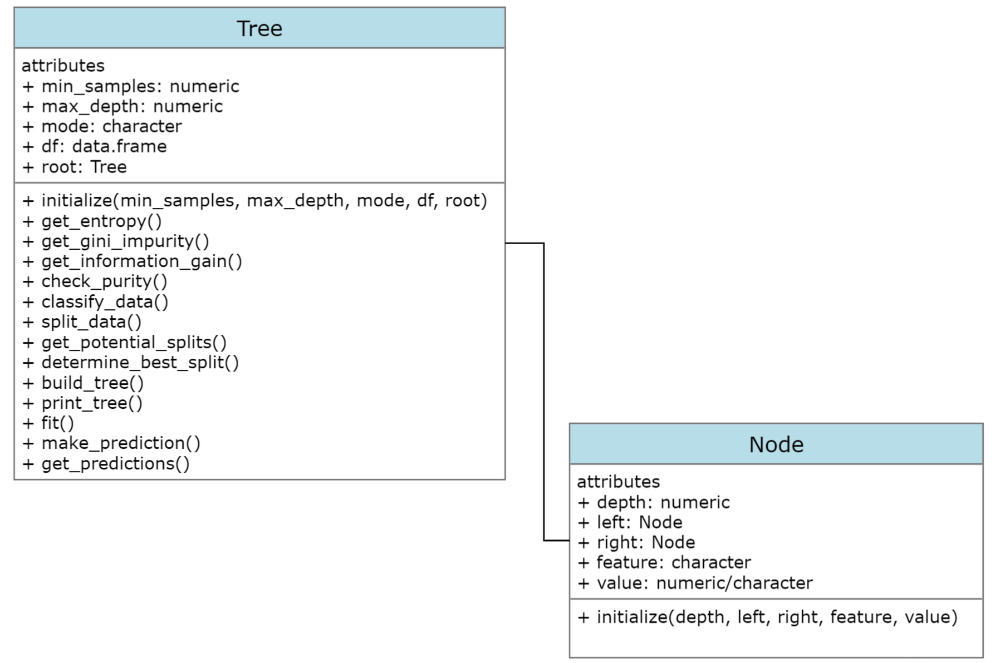

# Preface

This was my second attempt at creating a decision tree classifier. When I last attempted the problem of creating a decision tree classifier from scratch, my final solution was very incomplete. I was able to create a so called "recursive main function", that would print all the nodes and store them in a data frame. However, I was unable to convert these splits into a tree like format, paralleling that of those found in the `rpart` and `tree` libraries. My solution was also unable to make a prediction on a new data point, rather, it stopped at learning on the tree. So in essence, what I had made, was not even complete in the slightest sense. A model that cannot be tested on new unseen data, is essentially an useless model in the realm of machine learning. 

There were a few key reasons why I was unable to get to a good working solution. Firstly, there were a lot of variables and information that had to be kept tracked of. As the main recursive function generates the nodes, it was hard to store them in a tidy way, that could later be used to print the tree, and even have another function descend down it to get a new prediction. This stemmed in part from my poor understanding of how recursion worked on binary trees at the time. More so, my functional programming skills had hit a roadblock for this problem. I was also unsure whether the main recursive splitting function was working as it should, largely due to the inability to view the output of the function in a meaningful "tree-like" way. Looking back, all of these problems stemmed from one global issue — not having an adequate data structure. I was trying to create a decision tree using a data frame representation, when in actuality the best way to represent a tree, is just a tree. 

**Object Oriented Programming (OOP)** turned out to be the best solution to this problem. 

> Object-oriented programming (OOP) is a programming paradigm based on the concept of "objects", which can contain data and code. The data is in the form of fields (often known as attributes or properties), and the code is in the form of procedures (often known as methods). A common feature of objects is that procedures (or methods) are attached to them and can access and modify the object's data fields. In this brand of OOP, there is usually a special name such as this or self used to refer to the current object. In OOP, computer programs are designed by making them out of objects that interact with one another

In laymans terms OOP differs from procedural programming, in that it places more emphasis on the structure of the data 

> Most OOP lanuages define a class. A class is an abstract blueprint that creates more specific, concrete objects. Classes often represent broad categories, like Car or Dog that share attributes. These classes define what attributes an instance of this type will have, like color, but not the value of those attributes for a specific object. Classes can also contain functions called methods that are available only to objects of that type. These functions are defined within the class and perform some action helpful to that specific object type

Once again what this means is that we can create a blueprint for a data type, and then call specific functions on that data. These function can access and modify the attributes of this new data type (most of the time!). I have shown a simple example of this below for "rectangles". Rectangles is a not a data type that is default implemented in most languages like vectors or lists. But it is easy to define a rectangle geometrically, so let us make a special data type for rectangles (a class). We will then create a special function to act on this new data type; it will get the area.


```r
Rectangles = 
  setRefClass(Class = "rectangles",
              fields = list(x = "numeric", y = "numeric"), 
              methods = 
                list(get_area = 
                       function(){
                             return(.self$x*.self$y)
                           },
                     get_squared_area = 
                       function(){
                             r_area = .self$get_area()
                             return(.self$r_area^2)
                           },
                     get_cubed_area = 
                       function(){
                             r_area = .self$get_area()
                             return(r_area^3)
                           }
                         ))

r1 = Rectangles(x = 5, y = 4)
r1$get_area()
## [1] 20
r1$get_cubed_area()
## [1] 8000
```

So OOP is all about grouping related functions and variables together. Rather than having the functions and variables be made in isolation, which is what procedural programming focuses on, lets make them together. This was the technique which I needed to finish the problem of creating a decision tree classifier from scratch. Lastly there are a few more things I want to note about OOP. Programmers and computer science courses will often reference the "four pillars" behind OOP. Here is what they are. 

* **Inheritance**: Child classes inherit data and behaviors from the parent class
* **Encapsulation**: Containing information in an object, exposing only selected information
* **Abstraction**: Only exposing high-level public methods for accessing an object
* **Polymorphism**: Many methods can do the same task

R has several different ways of doing OOP, each using the four pillars to a different degree. These OOP systems are called S3, S4 and R6 (extension to RC). There are different trade off between using different systems. For those interested you may take a look at ***Hadley Wickham's Advanced R Book*** (it is a free bookdown). I will be using the R6 system, as it is the easiest, and most similar to other modern systems in data science geared languages.

# Class structure 

I created two classes in my OOP implementation of the decision tree classifier. One for the node and and one for the tree. The node is basic structure defining the main elements of node. That being its parent its childs, and the information the node contains (is it a decision or a split). Only the initialize method is defined for this class, it sets the default values to a node to null. The tree class contains all the helper functions as methods for creating the tree. It also contains the stopping conditions, the information metric to use, and the training data frame to use in its attributes. The root attribute, is where the fully grown tree is later stored to be used (saves computation time). Note that these two structures are not sub-classes or anything like that; the node class is merely used in one of the methods for the tree. Finally, the initialize method for the tree only assigns the root as NULL, with the rest being assigned their inputted values.



# Revised and new helper functions

Note that all of my functions have had small changes made to them. This small change is that I used the `$self` semantic of the R6 system for accessing and modifying attributes, as well as other methods. I will now discuss any major changes that I have made to my helper functions, and any new ones I created


```r
get_information_gain =
  function(parent, l_child, r_child, mode = self$mode){
    #Get weights in each child
    weight_l = nrow(l_child)/nrow(parent)
    weight_r = nrow(r_child)/nrow(parent)
    #Choose mode
    if(mode == "gini"){
    gain = self$get_gini_impurity(parent[, ncol(parent)]) - (weight_l*self$get_gini_impurity(l_child[, ncol(l_child)]) + weight_r*self$get_gini_impurity(r_child[, ncol(r_child)]))
        } else {
    gain = self$get_entropy(as.character(parent[, ncol(parent)])) - (weight_l*self$get_entropy(as.character(l_child[, ncol(l_child)])) + weight_r*self$get_entropy(as.character(r_child[, ncol(r_child)])))
        }
}
```

Previously, I only used entropy as my metric for finding the best split. I then calculated the weighted entropy, and found the split that had the lowest weighted entropy. I have since converted my functions to use information gain, with an option to choose either entropy or gini-impurity. Now the best split is the one that maximizes information gain. This change is reflected in my helper which finds the best split.


```r
build_tree = 
  function(df = self$df, curr_depth = 0){
  data = df
  #Split until stopping condition are met
  if(!any(self$check_purity(data), 
          nrow(data) < self$min_samples, 
          curr_depth == self$max_depth)){
    #Keep splitting
    #Get potential and best splits
    potential_splits = self$get_potential_splits(data)
    best_split = self$determine_best_split(data, potential_splits, mode = self$mode)
    #Record best split value and feature
    split_column = best_split[[1]]
    split_value = best_split[[2]]
    #Split by best combo and assign
    data_split = self$split_data(data, split_column, split_value)
    data_above = data_split[[1]]
    data_below = data_split[[2]]
    #Recursion occurs here
    left_subtree = self$build_tree(df = data_below, curr_depth = curr_depth + 1)
    right_subtree = self$build_tree(df = data_above, curr_depth = curr_depth + 1)
    #Return decision node
    return(Node$new(depth = curr_depth, left = left_subtree, right = right_subtree, feature = split_column, value = split_value))
          } else {
    #Stop splitting
    #Compute leaf node
    leaf.value = self$classify_data(data)
    return(Node$new(value = leaf.value, depth = curr_depth))
          }
}
```

This is by far the biggest change to my helpers from the v1 classifier. The idea behind the build tree is similar to what it was previously. In fact most of the code is the same. All that has changed is that when I call the function for recursion, I also create a new node using the new node class. This essentially just stores the nodes as the splits are being created, or when a stopping condition is met.


```r
print_tree = 
  function(tree = self$build_tree(self$df)){
    #Print decision node
    if(!is.null(tree$feature)){
    cat(tree$depth, paste0(paste(rep("\t", tree$depth), collapse = ""), tree$depth), tree$feature, "<=", tree$value, "\n")}
          #Check for nullity of left and right; leaf
    if(!any(is.null(tree$left), is.null(tree$right))){
      self$print_tree(tree = tree$left)
      self$print_tree(tree = tree$right)
    } else {
      cat(paste0(tree$depth, paste(rep("\t", tree$depth), collapse = ""), tree$depth), "predict:", tree$value, "\n")
          }
        }
```

The build tree functions creates the tree. It is stored in a data type called an environment in R. The print tree function descends down this environment recursively, and prints the important attributes needed for creating a visualization of the tree. The stopping conditions for my tree were if a node had no children. It was also important to print each part of the tree on a new line, and for nodes at the same depth to have the same indent. This makes following the tree visually quite easy to follow (although I must say my printing function is by no means the best).


```r
fit = 
  function(){
    #Build the tree once for predictions only
    self$root = self$build_tree()
  }
```

This method just builds the tree and stores it in an attribute of the tree class called root. Nothing special here. Storing the tree saves computation time later, when we have to make predictions on the testing data set. 


```r
make_prediction = 
  function(y, tree = self$root){
    if(class(tree$value) == "character") return(tree$value)
      partition.val = tree$value
      feature.num = which(names(self$df) == tree$feature)
      if(y[[feature.num]] < partition.val){
       self$make_prediction(y = y, tree = tree$left) 
      } else {
        self$make_prediction(y = y, tree = tree$right)
      }
}
```

The make prediction method takes a single row or observation and returns the predicted class. It works by descending down the tree we have build and stored recursively. It does this by looking converting each decision node into an if statement, and comparing the corresponding element of the new observation. The stopping condition here is if the value attribute is a character. In my class diagrams I should the value attribute could be numeric or character. The numeric case is for when the node is a decision node, and the character case is for when the node is a leaf node. 


```r
get_predictions =
  function(Y){
    predict.dt = double(length = nrow(Y))
    for(i in 1:nrow(Y)){
      row.val = as.numeric(Y[i, 1:(ncol(Y)-1)])
      predict.dt[i] = self$make_prediction(y = row.val)
      next(i)
    }
    return(predict.dt)
}
```

The final get prediction method takes a testing data frame and makes a prediction on each sample by calling the make prediction method for a single sample. It then returns these predictions

# Full OOP code

Here is the full code for the decision tree classifier


```r
Node = 
  R6Class(
    classname = "Node", 
    public = list(
      depth = "numeric", 
      left = NULL,
      right = NULL,
      feature = NULL, 
      value = NULL, 
      initialize =
        function(depth = NULL, left = NULL, right = NULL, feature = NULL, value = NULL){
          self$depth = depth
          self$left = left
          self$right = right
          self$feature = feature
          self$value = value
        })
  )

Tree = 
  R6Class(
    classname = "Tree",
    public = list(
      min_samples = "numeric", 
      max_depth = "numeric",
      mode = "character",
      df = "data.frame",
      root = NULL,
      initialize = 
        function(min_samples, max_depth, mode, df, root = NULL){
          self$min_samples = min_samples
          self$max_depth = max_depth
          self$mode = mode
          self$df = df
          self$root = root
        },
      get_entropy =
        function(x){
          if(length(x) == 0) return(0)
          weights = table(x)/length(x)
          info_content = -weights*log2(weights)
          entropy = sum(info_content)
          return(entropy)
        },
      get_gini_impurity =
        function(x){
        #Assume x is a factor with labels
        if(length(x) == 0) return(0)
        weights = table(x)/length(x)
        weights_squared = weights^2
        sum_of_squares = sum(weights_squared)
        gini = 1 - sum_of_squares
        return(gini)
      },
      get_information_gain =
        function(parent, l_child, r_child, mode = self$mode){
        #Get weights in each child
        weight_l = nrow(l_child)/nrow(parent)
        weight_r = nrow(r_child)/nrow(parent)
        #Choose mode
        if(mode == "gini"){
          gain = self$get_gini_impurity(parent[, ncol(parent)]) - (weight_l*self$get_gini_impurity(l_child[, ncol(l_child)]) + weight_r*self$get_gini_impurity(r_child[, ncol(r_child)]))
        } else {
          gain = self$get_entropy(as.character(parent[, ncol(parent)])) - (weight_l*self$get_entropy(as.character(l_child[, ncol(l_child)])) + weight_r*self$get_entropy(as.character(r_child[, ncol(r_child)])))
        }
      },
      check_purity = 
        function(data){
          #Get unique labels
          labels = length(unique(data[, ncol(data)]))
          #Check if there is only one
          ifelse(labels == 1, return(TRUE), return(FALSE))
        },
      classify_data = 
        function(data){
          #Get labels
          get_labels = data[, ncol(data)]
          #Get label frequency and max
          label_freq = table(get_labels)
          label_freq_a = as.data.frame(label_freq)
          label_dom = max(label_freq)
          #Get classification
          for(i in 1:nrow(label_freq_a)){
            if(label_freq_a$Freq[i] == label_dom){
              classification = as.character(label_freq_a$get_labels[i])
            } else {
              next(i)
            }
          }
          return(classification)
        },
      split_data =
        function(data, split_column, split_value){
          split_c = data[[split_column]]
          #Filter the data into above and below
          data_below = data[split_c <= split_value, ]
          data_above = data[split_c > split_value, ]
          return(list(data_above, data_below))
        },
      get_potential_splits =
        function(data){
          #Sorting stage
          data = data
          col_n = ncol(data) - 1
          for(i in 1:col_n){
            data_i = sort(data[, i])
            data[, i] = data_i
          }
          #Creating the splits
          dat = data[0, ]
          for(j in 1:col_n){
            for(i in 2:nrow(data)){
              curr_val = data[i, j]
              previous_val = data[(i-1), j]
              potential_val = (curr_val + previous_val)/2
              dat[(i-1), j] = potential_val
            }
          }
          dat[nrow(dat)+1, ] = data[nrow(data), ]
          dat = dat[, 1:col_n]
          potential_splits = as.data.frame(dat)
          if(ncol(potential_splits) == 1){
            colnames(potential_splits)[[1]] = colnames(data)[[1]]
          }
          return(potential_splits)
        },
      determine_best_split =
        function(data, potential_splits, mode = self$mode){
        #Initialize information, feature, feature val
        running_gain = -Inf
        best_split_value = 0
        best_split_column = ""
        #Find best entropy over potential splits
        for(j in 1:ncol(potential_splits)){
          for(i in unique(potential_splits[, j])){
            mask_val = i 
            mask_col = j
            splits = self$split_data(data = data, split_column = mask_col, split_value = mask_val)
            relative_gain = self$get_information_gain(parent = data, r_child = splits[[1]], l_child = splits[[2]], mode = mode)
            if(relative_gain > running_gain){
              running_gain = relative_gain
              best_split_value = mask_val
              best_split_column = colnames(potential_splits)[j]
            } else {
              next(i)
            }
          }
        }
        return(list(best_split_column, best_split_value))
      },
      build_tree = 
        function(df = self$df, curr_depth = 0){
          data = df
          #Split until stopping condition are met
          if(!any(self$check_purity(data), 
                  nrow(data) < self$min_samples, 
                  curr_depth == self$max_depth)){
            #Keep splitting
            #Get potential and best splits
            potential_splits = self$get_potential_splits(data)
            best_split = self$determine_best_split(data, potential_splits, mode = self$mode)
            #Record best split value and feature
            split_column = best_split[[1]]
            split_value = best_split[[2]]
            #Split by best combo and assign
            data_split = self$split_data(data, split_column, split_value)
            data_above = data_split[[1]]
            data_below = data_split[[2]]
            #Recursion occurs here
            left_subtree = self$build_tree(df = data_below, curr_depth = curr_depth + 1)
            right_subtree = self$build_tree(df = data_above, curr_depth = curr_depth + 1)
            #Return decision node
            return(Node$new(depth = curr_depth, left = left_subtree, right = right_subtree, feature = split_column, value = split_value))
          } else {
            #Stop splitting
            #Compute leaf node
            leaf.value = self$classify_data(data)
            return(Node$new(value = leaf.value, depth = curr_depth))
          }
        }, 
      print_tree =
        function(tree = self$build_tree(self$df)){
          #Print decision node
          if(!is.null(tree$feature)){
          cat(tree$depth, paste0(paste(rep("\t", tree$depth), collapse = ""), tree$depth), tree$feature, "<=", tree$value, "\n")}
          #Check for nullity of left and right; leaf
          if(!any(is.null(tree$left), is.null(tree$right))){
            self$print_tree(tree = tree$left)
            self$print_tree(tree = tree$right)
          } else {
            cat(paste0(tree$depth, paste(rep("\t", tree$depth), collapse = ""), tree$depth), "predict:", tree$value, "\n")
          }
        },
      fit =
        function(){
          #Build the tree once for predictions only
          self$root = self$build_tree()
        },
      make_prediction = 
        function(y, tree = self$root){
          if(class(tree$value) == "character") return(tree$value)
          partition.val = tree$value
          feature.num = which(names(self$df) == tree$feature)
          if(y[[feature.num]] < partition.val){
           self$make_prediction(y = y, tree = tree$left) 
          } else {
            self$make_prediction(y = y, tree = tree$right)
          }
        }, 
      get_predictions =
        function(Y){
          predict.dt = double(length = nrow(Y))
          for(i in 1:nrow(Y)){
            row.val = as.numeric(Y[i, 1:(ncol(Y)-1)])
            predict.dt[i] = self$make_prediction(y = row.val)
            next(i)
          }
          return(predict.dt)
        }
      
      
    ))
```

# Testing

## Salmon-tuna dataset

We begin by first creating a train test split


```r
set.seed(2310)
salmon_fish_split = train_test_split(data = salmon_fish, test = 0.1)
salmon_fish_train = subset(salmon_fish_split, salmon_fish_split$my.folds == "train")[, -4]
salmon_fish_test = subset(salmon_fish_split, salmon_fish_split$my.folds == "test")[, -4]
```


We first specify the parameters for our new tree by creating an instance of the `Tree` class


```r
dtree = Tree$new(min_samples = 10, 
                 max_depth = 5, 
                 mode = "entropy", 
                 df = salmon_fish_train)
```

We then can build the tree according to these parameters. Lets run the fit method as well in anticipation for making a prediction after. We will also print three


```r
#Build tree for viewing
btree = dtree$build_tree()
#Store for predictions
dtree$fit()
#Print the tree
dtree$print_tree()
```

```
## 0 0 length <= 2.996015 
## 1	1 predict: tuna 
## 1 	1 weight <= 4.006707 
## 2		2 predict: salmon 
## 2 		2 length <= 6.978225 
## 3 			3 length <= 4.998481 
## 4 				4 weight <= 6.948427 
## 5					5 predict: tuna 
## 5					5 predict: salmon 
## 4 				4 length <= 6.017146 
## 5					5 predict: tuna 
## 5					5 predict: salmon 
## 3			3 predict: tuna
```

We can make a prediction on a single value. If you remember the graph from my v1 version of the salmon-fish df, you can visually confirm that the function works correctly.


```r
dtree$make_prediction(y = c(7.5, 2.5))
```

```
## [1] "salmon"
```

We can then also make a prediction on the training set as well and calculate the accuracy for this particular train test split


```r
predictions = salmon_fish_test$type == dtree$get_predictions(Y = salmon_fish_test)
accuracy = length(which(predictions == TRUE))/nrow(salmon_fish_test)
print(accuracy)
```

```
## [1] 0.94
```

The accuracy for this particular split is 94%. 

## Iris dataset

Below is an example for the iris data set. I have changed the parameters of the tree as well this time. 


```r
#Train test split
set.seed(2310)
iris_split = train_test_split(data = iris, test = 0.1)
iris_train = subset(iris_split, iris_split$my.folds == "train")[, -6]
iris_test = subset(iris_split, iris_split$my.folds == "test")[, -6]

#Create instance 
itree = Tree$new(min_samples = 7, 
                 max_depth = 7, 
                 mode = "gini", 
                 df = iris_train)

#Build tree for viewing
jtree = dtree$build_tree()
#Store for predictions
itree$fit()
#Print the tree
itree$print_tree()
```

```
## 0 0 Petal.Length <= 1.9 
## 1	1 predict: setosa 
## 1 	1 Petal.Width <= 1.7 
## 2 		2 Petal.Length <= 4.9 
## 3 			3 Petal.Width <= 1.65 
## 4				4 predict: versicolor 
## 4				4 predict: virginica 
## 3			3 predict: virginica 
## 2 		2 Petal.Length <= 4.8 
## 3			3 predict: virginica 
## 3			3 predict: virginica
```

```r
#Accuracy on testing data
predictions = iris_test$Species == itree$get_predictions(Y = iris_test)
accuracy = length(which(predictions == TRUE))/nrow(iris_test)
print(accuracy)
```

```
## [1] 1
```

The accuracy for this particular split is 100%.


## Single variable example 

Below, I would just like to highlight that this implementation works on data set with a single predictor only.


```r
ztree = Tree$new(min_samples = 7, 
                 max_depth = 6, 
                 mode = "entropy", 
                 df = iris[, c(3,5)])
ltree = ztree$build_tree()
ztree$fit()
ztree$print_tree()
```

```
## 0 0 Petal.Length <= 1.9 
## 1	1 predict: setosa 
## 1 	1 Petal.Length <= 4.7 
## 2 		2 Petal.Length <= 4.4 
## 3			3 predict: versicolor 
## 3 			3 Petal.Length <= 4.5 
## 4 				4 Petal.Length <= 4.5 
## 5 					5 Petal.Length <= 4.5 
## 6						6 predict: versicolor 
## 6						6 predict: virginica 
## 5					5 predict: virginica 
## 4				4 predict: versicolor 
## 2 		2 Petal.Length <= 5.1 
## 3 			3 Petal.Length <= 4.9 
## 4 				4 Petal.Length <= 4.8 
## 5					5 predict: virginica 
## 5					5 predict: virginica 
## 4 				4 Petal.Length <= 5 
## 5					5 predict: virginica 
## 5 					5 Petal.Length <= 5.1 
## 6						6 predict: virginica 
## 6						6 predict: virginica 
## 3			3 predict: virginica
```
